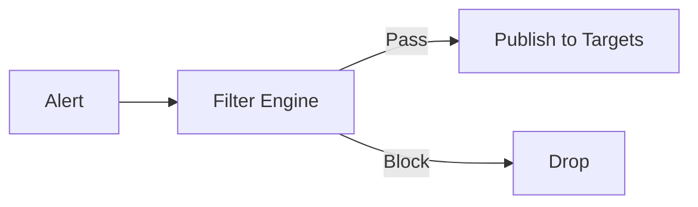
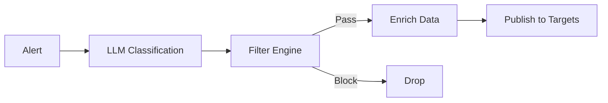

# Enrichment Mode API

## Overview

The Enrichment Mode API allows you to control how Alert History Service processes incoming alerts. The service supports three enrichment modes with dynamic switching capability.

## Enrichment Modes

### 1. `transparent`
**Default behavior without LLM classification**

- ✅ Proxy alerts to all configured targets (Rootly, PagerDuty, Slack)
- ✅ Apply filter rules (noise reduction)
- ❌ NO LLM classification
- 📊 Useful for: bypassing LLM when it's down or for testing



### 2. `enriched` ⭐
**Full LLM classification with filtering (DEFAULT)**

- ✅ LLM classification (severity, team, context)
- ✅ Apply filter rules
- ✅ Enrich alert data with LLM insights
- ✅ Dynamic target selection based on classification
- 📊 Useful for: production, intelligent routing



### 3. `transparent_with_recommendations`
**Bypass mode for critical situations**

- ✅ Proxy ALL alerts without modification
- ❌ NO LLM classification
- ❌ NO filtering (bypass everything)
- 📊 Useful for: emergency situations, testing raw alert flow


## State Storage and Fallback Chain

The enrichment mode is resolved using a **fallback chain**:

```
1. Redis (distributed, persistent)
     ↓ (if not found or Redis unavailable)
2. ENV variable (ENRICHMENT_MODE)
     ↓ (if not set)
3. Default (enriched)
```

### Advantages:
- **Redis**: Distributed state, dynamic switching, no restarts
- **ENV**: Static configuration, fallback when Redis is down
- **Default**: Always have a working mode

## API Endpoints

### GET /enrichment/mode

Get current enrichment mode and its source.

#### Request

```bash
curl -X GET http://localhost:8080/enrichment/mode
```

#### Response

```json
{
  "mode": "enriched",
  "source": "redis"
}
```

**Fields:**
- `mode` (string): Current enrichment mode (`transparent`, `enriched`, `transparent_with_recommendations`)
- `source` (string): Source of the mode value (`redis`, `env`, `default`)

**Status Codes:**
- `200 OK`: Success
- `500 Internal Server Error`: Failed to retrieve mode

---

### POST /enrichment/mode

Set new enrichment mode. The mode is saved to Redis (if available) and cached in memory.

#### Request

```bash
curl -X POST http://localhost:8080/enrichment/mode \
  -H "Content-Type: application/json" \
  -d '{"mode": "transparent"}'
```

**Body:**
```json
{
  "mode": "transparent"
}
```

**Fields:**
- `mode` (string, required): New enrichment mode
  - Valid values: `transparent`, `enriched`, `transparent_with_recommendations`

#### Response

```json
{
  "mode": "transparent",
  "source": "redis"
}
```

**Status Codes:**
- `200 OK`: Mode updated successfully
- `400 Bad Request`: Invalid mode or JSON
- `500 Internal Server Error`: Failed to save mode

---

## Prometheus Metrics

### `alert_history_enrichment_mode_switches_total`
**Type:** Counter
**Labels:** `from_mode`, `to_mode`
**Description:** Total number of enrichment mode switches

```promql
# Rate of mode switches in the last 5 minutes
rate(alert_history_enrichment_mode_switches_total[5m])

# Total switches from enriched to transparent
alert_history_enrichment_mode_switches_total{from_mode="enriched", to_mode="transparent"}
```

### `alert_history_enrichment_mode_status`
**Type:** Gauge
**Description:** Current enrichment mode (0=transparent, 1=enriched, 2=transparent_with_recommendations)

```promql
# Current mode across all instances
alert_history_enrichment_mode_status

# Alert if mode is not enriched (expected production mode)
alert_history_enrichment_mode_status != 1
```

### `alert_history_enrichment_mode_requests_total`
**Type:** Counter
**Labels:** `method` (GET/POST), `mode`
**Description:** Total number of enrichment mode API requests

```promql
# Rate of mode API requests
rate(alert_history_enrichment_mode_requests_total[5m])

# POST requests (mode changes)
alert_history_enrichment_mode_requests_total{method="POST"}
```

### `alert_history_enrichment_redis_errors_total`
**Type:** Counter
**Description:** Total number of Redis errors encountered by the enrichment mode manager

```promql
# Redis error rate
rate(alert_history_enrichment_redis_errors_total[5m])

# Alert if Redis errors > 10 in 5 minutes
increase(alert_history_enrichment_redis_errors_total[5m]) > 10
```

---

## Usage Examples

### 1. Check Current Mode

```bash
curl http://localhost:8080/enrichment/mode
```

### 2. Switch to Transparent Mode (Bypass LLM)

```bash
curl -X POST http://localhost:8080/enrichment/mode \
  -H "Content-Type: application/json" \
  -d '{"mode": "transparent"}'
```

### 3. Switch to Enriched Mode (Production)

```bash
curl -X POST http://localhost:8080/enrichment/mode \
  -H "Content-Type: application/json" \
  -d '{"mode": "enriched"}'
```

### 4. Emergency Bypass (No Filtering)

```bash
curl -X POST http://localhost:8080/enrichment/mode \
  -H "Content-Type: application/json" \
  -d '{"mode": "transparent_with_recommendations"}'
```

### 5. Monitor Mode Changes (Prometheus)

```promql
# See all mode switches in the last hour
increase(alert_history_enrichment_mode_switches_total[1h])
```

---

## Configuration

### Redis Configuration (config.yaml)

```yaml
redis:
  addr: "localhost:6379"
  password: ""
  db: 0
  pool_size: 10
  min_idle_conns: 5
  dial_timeout: "5s"
  read_timeout: "3s"
  write_timeout: "3s"
  max_retries: 3
```

### Environment Variable

```bash
# Set default mode via ENV (fallback when Redis is unavailable)
export ENRICHMENT_MODE=enriched

# Run service
./alert-history
```

### Service Startup

```bash
# With Redis (recommended for production)
./alert-history -config config.yaml

# Without Redis (ENV fallback)
ENRICHMENT_MODE=transparent ./alert-history
```

---

## Operational Scenarios

### Scenario 1: LLM Service Down

**Problem:** LLM classification service is unavailable, alerts are stuck.

**Solution:** Switch to transparent mode to bypass LLM.

```bash
curl -X POST http://localhost:8080/enrichment/mode \
  -H "Content-Type: application/json" \
  -d '{"mode": "transparent"}'
```

### Scenario 2: Testing New Filters

**Problem:** Need to test filter rules without LLM overhead.

**Solution:** Use transparent mode during testing.

```bash
# Switch to transparent
curl -X POST http://localhost:8080/enrichment/mode -d '{"mode": "transparent"}'

# Run tests
./run_tests.sh

# Switch back to enriched
curl -X POST http://localhost:8080/enrichment/mode -d '{"mode": "enriched"}'
```

### Scenario 3: Critical Incident

**Problem:** Missing critical alerts due to aggressive filtering.

**Solution:** Temporarily disable filtering with transparent_with_recommendations.

```bash
curl -X POST http://localhost:8080/enrichment/mode \
  -d '{"mode": "transparent_with_recommendations"}'
```

⚠️ **WARNING:** This mode bypasses ALL filtering. Use only in emergencies!

### Scenario 4: Redis Outage

**Problem:** Redis is down, but service should continue.

**Behavior:** Service automatically falls back to ENV or default mode.

```
2024-10-09 10:30:00 WARN Redis ping failed, enrichment mode will fallback to ENV/default
2024-10-09 10:30:00 INFO Enrichment Mode Manager initialized mode=enriched source=env
```

---

## Performance Considerations

### In-Memory Caching

- Current mode is **cached in memory** for fast access
- Cache is **auto-refreshed** every 30 seconds from Redis
- No Redis round-trip on every alert (only on cache refresh)

### Latency

- **GET /enrichment/mode**: < 1ms (in-memory read)
- **POST /enrichment/mode**: ~5-10ms (Redis write + memory update)
- **Alert processing**: < 0.1ms overhead (memory read)

### High Availability

- **No single point of failure**: ENV fallback ensures service continues even if Redis is down
- **Distributed state**: Multiple instances share the same mode via Redis
- **Graceful degradation**: Redis errors don't stop alert processing

---

## Security Considerations

⚠️ **TODO (Phase 3):** Add authentication for POST /enrichment/mode

Currently, the POST endpoint is **unprotected**. For production:

1. Add API key authentication
2. Add RBAC (Role-Based Access Control)
3. Add audit logging for mode changes
4. Rate limit POST requests

---

## Integration with Alert Processing

The enrichment mode affects the entire alert processing pipeline:

```go
// Webhook handler pseudo-code
func ProcessAlert(alert Alert) error {
    mode := enrichmentManager.GetMode()

    switch mode {
    case EnrichmentModeEnriched:
        // Full pipeline
        classification := llmService.Classify(alert)
        if filterEngine.ShouldBlock(alert, classification) {
            return nil // Drop
        }
        enrichedAlert := enricher.Enrich(alert, classification)
        return publisher.Publish(enrichedAlert, classification.Targets)

    case EnrichmentModeTransparent:
        // No LLM, but with filtering
        if filterEngine.ShouldBlock(alert, nil) {
            return nil // Drop
        }
        return publisher.PublishToAll(alert)

    case EnrichmentModeTransparentWithRecommendations:
        // Bypass everything
        return publisher.PublishToAll(alert)
    }
}
```

---

## Monitoring & Alerting

### Recommended Prometheus Alerts

```yaml
# Alert if mode is not enriched in production for > 10 minutes
- alert: EnrichmentModeNotEnriched
  expr: alert_history_enrichment_mode_status != 1
  for: 10m
  labels:
    severity: warning
  annotations:
    summary: "Enrichment mode is not enriched (expected for production)"

# Alert if too many mode switches (possible flapping)
- alert: EnrichmentModeFlapping
  expr: increase(alert_history_enrichment_mode_switches_total[5m]) > 5
  labels:
    severity: warning
  annotations:
    summary: "Enrichment mode switching too frequently"

# Alert if Redis errors are high
- alert: EnrichmentRedisErrors
  expr: increase(alert_history_enrichment_redis_errors_total[5m]) > 10
  labels:
    severity: critical
  annotations:
    summary: "High Redis error rate for enrichment mode"
```

---

## Python Parity

This Go implementation maintains **100% feature parity** with the Python reference implementation:

| Feature | Python | Go | Status |
|---------|--------|-----|--------|
| 3 enrichment modes | ✅ | ✅ | 100% |
| Fallback chain (Redis → ENV → default) | ✅ | ✅ | 100% |
| GET /enrichment/mode | ✅ | ✅ | 100% |
| POST /enrichment/mode | ✅ | ✅ | 100% |
| Prometheus metrics (4 types) | ✅ | ✅ | 100% |
| In-memory caching | ✅ | ✅ | 100% |
| Auto-refresh cache | ✅ | ✅ | 100% |
| Redis health check | ✅ | ✅ | 100% |
| Graceful Redis fallback | ✅ | ✅ | 100% |
| Mode validation | ✅ | ✅ | 100% |
| Stats endpoint | ✅ | ✅ | 100% |
| Concurrent access safety | ✅ | ✅ | 100% |
| **TOTAL** | ✅ | ✅ | **100%** |

---

## See Also

- [DEPLOYMENT.md](./DEPLOYMENT.md) - Deployment guide
- [ENRICHMENT_MODES.md](./ENRICHMENT_MODES.md) - Detailed mode behavior
- [API.md](./API.md) - Main API documentation
- [DASHBOARD.md](./DASHBOARD.md) - Grafana dashboard setup
