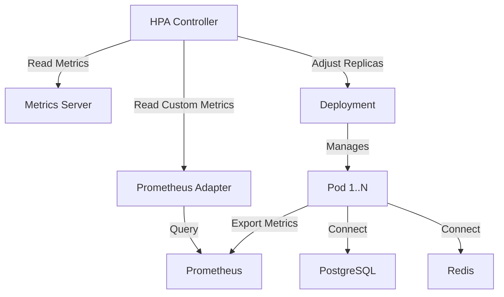

# TN-97: HPA Configuration - Design Document

**Task ID:** TN-97
**Phase:** 13 - Production Packaging
**Date:** 2025-11-29
**Quality Target:** 150% (Grade A+)

---

## 🎯 Design Overview

This document outlines the **technical architecture** and **implementation strategy** for Horizontal Pod Autoscaler (HPA) configuration in Alertmanager++ OSS Core **Standard Profile**.

### Design Principles

1. **Profile-Aware:** HPA only for Standard profile, zero impact on Lite profile
2. **Production-Ready:** Enterprise-grade scaling behavior
3. **Backward Compatible:** Zero breaking changes for existing deployments
4. **Observable:** Full monitoring and alerting integration
5. **Configurable:** Flexible configuration via values.yaml

---

## 📐 Architecture

### System Context

```
┌─────────────────────────────────────────────────────────────┐
│                  Kubernetes Cluster                         │
│                                                             │
│  ┌─────────────────┐         ┌──────────────────┐         │
│  │  Metrics Server │←────────│  HPA Controller   │         │
│  │  (CPU/Memory)   │         │  (K8s Core)       │         │
│  └─────────────────┘         └──────────────────┘         │
│          ↑                            │                     │
│          │                            │ Adjust replicas     │
│          │                            ↓                     │
│  ┌──────────────────────────────────────────────────┐     │
│  │      AlertHistory Deployment (Standard Profile)   │     │
│  │                                                    │     │
│  │  ┌────────┐  ┌────────┐  ┌────────┐  ┌────────┐ │     │
│  │  │ Pod 1  │  │ Pod 2  │  │ Pod 3  │  │ Pod N  │ │     │
│  │  └────────┘  └────────┘  └────────┘  └────────┘ │     │
│  │       │            │            │            │    │     │
│  └───────┼────────────┼────────────┼────────────┼────┘     │
│          └────────────┴────────────┴────────────┘          │
│                         │                                   │
│  ┌─────────────────────┴────────────────────────┐         │
│  │          PostgreSQL StatefulSet              │         │
│  │          (Connection Pooling)                │         │
│  └──────────────────────────────────────────────┘         │
│                                                             │
│  ┌────────────────────────────────────────────────────┐   │
│  │      Prometheus Adapter (Custom Metrics)           │   │
│  │                                                     │   │
│  │  - alert_history_api_requests_per_second          │   │
│  │  - alert_history_business_classification_queue    │   │
│  │  - alert_history_business_publishing_queue        │   │
│  └────────────────────────────────────────────────────┘   │
└─────────────────────────────────────────────────────────────┘
```

### Component Interaction



---

## 🏗️ Implementation Design

### 1. HPA Template Structure

**File:** `helm/alert-history/templates/hpa.yaml`

```yaml
{{- if and .Values.autoscaling.enabled (eq .Values.profile "standard") }}
apiVersion: autoscaling/v2
kind: HorizontalPodAutoscaler
metadata:
  name: {{ include "alert-history.fullname" . }}
  namespace: {{ .Values.namespace | default .Release.Namespace }}
  labels:
    {{- include "alert-history.labels" . | nindent 4 }}
  annotations:
    description: "Horizontal Pod Autoscaler for Alertmanager++ Standard Profile"
    managed-by: {{ .Release.Service }}
spec:
  scaleTargetRef:
    apiVersion: apps/v1
    kind: Deployment
    name: {{ include "alert-history.fullname" . }}
  minReplicas: {{ .Values.autoscaling.minReplicas | default 2 }}
  maxReplicas: {{ .Values.autoscaling.maxReplicas | default 10 }}

  # Resource-based metrics (CPU, Memory)
  metrics:
    {{- if .Values.autoscaling.targetCPUUtilizationPercentage }}
    - type: Resource
      resource:
        name: cpu
        target:
          type: Utilization
          averageUtilization: {{ .Values.autoscaling.targetCPUUtilizationPercentage }}
    {{- end }}
    {{- if .Values.autoscaling.targetMemoryUtilizationPercentage }}
    - type: Resource
      resource:
        name: memory
        target:
          type: Utilization
          averageUtilization: {{ .Values.autoscaling.targetMemoryUtilizationPercentage }}
    {{- end }}

    # Custom metrics (business metrics)
    {{- if .Values.autoscaling.customMetrics.enabled }}
    {{- if .Values.autoscaling.customMetrics.requestsPerSecond }}
    - type: Pods
      pods:
        metric:
          name: alert_history_api_requests_per_second
        target:
          type: AverageValue
          averageValue: {{ .Values.autoscaling.customMetrics.requestsPerSecond | quote }}
    {{- end }}
    {{- if .Values.autoscaling.customMetrics.classificationQueueSize }}
    - type: Pods
      pods:
        metric:
          name: alert_history_business_classification_queue_size
        target:
          type: AverageValue
          averageValue: {{ .Values.autoscaling.customMetrics.classificationQueueSize | quote }}
    {{- end }}
    {{- if .Values.autoscaling.customMetrics.publishingQueueSize }}
    - type: Pods
      pods:
        metric:
          name: alert_history_business_publishing_queue_size
        target:
          type: AverageValue
          averageValue: {{ .Values.autoscaling.customMetrics.publishingQueueSize | quote }}
    {{- end }}
    {{- end }}

  # Advanced scaling behavior
  {{- with .Values.autoscaling.behavior }}
  behavior:
    {{- if .scaleDown }}
    scaleDown:
      stabilizationWindowSeconds: {{ .scaleDown.stabilizationWindowSeconds | default 300 }}
      policies:
        {{- if .scaleDown.percentPolicy }}
        - type: Percent
          value: {{ .scaleDown.percentPolicy }}
          periodSeconds: {{ .scaleDown.periodSeconds | default 60 }}
        {{- end }}
        {{- if .scaleDown.podsPolicy }}
        - type: Pods
          value: {{ .scaleDown.podsPolicy }}
          periodSeconds: {{ .scaleDown.periodSeconds | default 60 }}
        {{- end }}
      selectPolicy: Min
    {{- end }}
    {{- if .scaleUp }}
    scaleUp:
      stabilizationWindowSeconds: {{ .scaleUp.stabilizationWindowSeconds | default 60 }}
      policies:
        {{- if .scaleUp.percentPolicy }}
        - type: Percent
          value: {{ .scaleUp.percentPolicy }}
          periodSeconds: {{ .scaleUp.periodSeconds | default 30 }}
        {{- end }}
        {{- if .scaleUp.podsPolicy }}
        - type: Pods
          value: {{ .scaleUp.podsPolicy }}
          periodSeconds: {{ .scaleUp.periodSeconds | default 30 }}
        {{- end }}
      selectPolicy: Max
    {{- end }}
  {{- end }}
{{- end }}
```

### 2. Profile-Aware Deployment

**File:** `helm/alert-history/templates/deployment.yaml` (modification)

**Current behavior:**
```yaml
spec:
  {{- if not .Values.autoscaling.enabled }}
  replicas: {{ .Values.replicaCount }}
  {{- end }}
```

**Enhanced behavior (no change needed - already correct):**
```yaml
spec:
  # Lite Profile: Use replicaCount (fixed 1 replica)
  # Standard Profile with HPA: Let HPA control replicas
  # Standard Profile without HPA: Use replicaCount
  {{- if not .Values.autoscaling.enabled }}
  replicas: {{ .Values.replicaCount }}
  {{- end }}
```

### 3. Values.yaml Configuration

**File:** `helm/alert-history/values.yaml` (already exists, no changes needed)

**Current configuration** (lines 127-148):
```yaml
autoscaling:
  enabled: true
  minReplicas: 2
  maxReplicas: 10
  targetCPUUtilizationPercentage: 70
  targetMemoryUtilizationPercentage: 80
  customMetrics:
    enabled: true
    requestsPerSecond: "50"
    classificationQueueSize: "10"
    publishingQueueSize: "20"
  behavior:
    scaleDown:
      stabilizationWindowSeconds: 300
      percentPolicy: 50
      podsPolicy: 2
      periodSeconds: 60
    scaleUp:
      stabilizationWindowSeconds: 60
      percentPolicy: 100
      podsPolicy: 4
      periodSeconds: 30
```

**Additional configuration options (optional enhancements):**
```yaml
autoscaling:
  # ... existing config ...

  # Optional: Cost-saving mode (allow 1 replica minimum)
  costSavingMode: false  # If true, minReplicas=1

  # Optional: Aggressive scaling mode
  aggressiveScaling: false  # If true, faster scale-up
```

---

## 🔄 Scaling Logic

### Decision Flow

```
┌─────────────────────────────────────────────────────────┐
│  HPA Controller (every 15-30 seconds)                    │
└─────────────────────────────────────────────────────────┘
                      │
                      ↓
         ┌────────────────────────┐
         │  Check Profile          │
         │  if profile != standard │
         │  → Skip HPA             │
         └────────────────────────┘
                      │
                      ↓
         ┌────────────────────────┐
         │  Collect Metrics        │
         │  - CPU utilization      │
         │  - Memory utilization   │
         │  - Custom metrics       │
         └────────────────────────┘
                      │
                      ↓
         ┌────────────────────────┐
         │  Calculate Desired      │
         │  Replicas               │
         │  (formula below)        │
         └────────────────────────┘
                      │
                      ↓
         ┌────────────────────────┐
    ┌────│  Desired > Current?     │────┐
    │    └────────────────────────┘    │
    │ YES                           NO  │
    ↓                                   ↓
┌──────────┐                    ┌──────────┐
│ Scale Up │                    │Scale Down│
│ Policy   │                    │ Policy   │
└──────────┘                    └──────────┘
    │                                   │
    ↓                                   ↓
┌──────────────────────────────────────────┐
│  Apply Stabilization Window               │
│  - Scale-up: 60s                          │
│  - Scale-down: 300s                       │
└──────────────────────────────────────────┘
                      │
                      ↓
┌──────────────────────────────────────────┐
│  Apply Replica Bounds                     │
│  - Min: 2 (or 1 if cost-saving)          │
│  - Max: 10                                │
└──────────────────────────────────────────┘
                      │
                      ↓
┌──────────────────────────────────────────┐
│  Update Deployment Replicas               │
└──────────────────────────────────────────┘
```

### Replica Calculation Formula

**HPA uses the following formula for each metric:**

```
desiredReplicas = ceil[currentReplicas * (currentMetricValue / targetMetricValue)]
```

**Example 1: CPU-based scaling**
- Current replicas: 2
- Current CPU: 85%
- Target CPU: 70%
- Desired replicas: ceil[2 * (85 / 70)] = ceil[2.43] = **3 replicas** ✅

**Example 2: Custom metric (requests/sec)**
- Current replicas: 3
- Current req/s per pod: 75
- Target req/s per pod: 50
- Desired replicas: ceil[3 * (75 / 50)] = ceil[4.5] = **5 replicas** ✅

**Multiple Metrics:** HPA uses the **highest desired replicas** from all metrics.

---

## 📊 Scaling Policies

### Scale-Up Policy (Aggressive)

**Goal:** Respond quickly to load spikes to prevent service degradation.

```yaml
scaleUp:
  stabilizationWindowSeconds: 60
  policies:
    - type: Percent
      value: 100       # Double replicas if needed
      periodSeconds: 30
    - type: Pods
      value: 4         # Add up to 4 pods at once
      periodSeconds: 30
  selectPolicy: Max    # Choose the most aggressive policy
```

**Behavior:**
- Evaluation every 30 seconds
- Can scale up by 100% (double replicas) OR add 4 pods (whichever is more aggressive)
- Stabilization window: 60s (waits 60s to confirm sustained high load)

**Example:**
- 2 replicas @ 85% CPU → Scale to 4 replicas (100% increase)
- 5 replicas @ 80% CPU → Scale to 9 replicas (+4 pods, since 100% = +5 exceeds max)

---

### Scale-Down Policy (Conservative)

**Goal:** Prevent flapping and service disruptions during traffic variations.

```yaml
scaleDown:
  stabilizationWindowSeconds: 300
  policies:
    - type: Percent
      value: 50        # Reduce by at most 50%
      periodSeconds: 60
    - type: Pods
      value: 2         # Remove at most 2 pods
      periodSeconds: 60
  selectPolicy: Min    # Choose the least aggressive policy
```

**Behavior:**
- Evaluation every 60 seconds
- Can scale down by at most 50% OR remove 2 pods (whichever is less aggressive)
- Stabilization window: 300s (waits 5 minutes to confirm sustained low load)

**Example:**
- 10 replicas @ 40% CPU → Scale to 8 replicas (-2 pods, since 50% = -5 is too aggressive)
- 4 replicas @ 30% CPU → Scale to 2 replicas (-2 pods = 50% reduction)

---

## 🔧 Custom Metrics Integration

### Prometheus Adapter Configuration

**Required for custom metrics support.**

**File:** `prometheus-adapter-values.yaml` (external, user must install)

```yaml
rules:
  custom:
    # API requests per second per pod
    - seriesQuery: 'alert_history_infra_http_requests_total'
      resources:
        overrides:
          namespace: {resource: "namespace"}
          pod: {resource: "pod"}
      name:
        matches: "^(.*)_total$"
        as: "alert_history_api_requests_per_second"
      metricsQuery: 'rate(<<.Series>>{<<.LabelMatchers>>}[1m])'

    # Classification queue size per pod
    - seriesQuery: 'alert_history_business_classification_queue_size'
      resources:
        overrides:
          namespace: {resource: "namespace"}
          pod: {resource: "pod"}
      name:
        as: "alert_history_business_classification_queue_size"
      metricsQuery: 'avg_over_time(<<.Series>>{<<.LabelMatchers>>}[1m])'

    # Publishing queue size per pod
    - seriesQuery: 'alert_history_business_publishing_queue_size'
      resources:
        overrides:
          namespace: {resource: "namespace"}
          pod: {resource: "pod"}
      name:
        as: "alert_history_business_publishing_queue_size"
      metricsQuery: 'avg_over_time(<<.Series>>{<<.LabelMatchers>>}[1m])'
```

### Graceful Degradation

**If Prometheus Adapter is not installed:**
- HPA will only use CPU/Memory metrics (Resource type)
- Custom metrics will be ignored silently
- HPA will still function with reduced capabilities

**Operator guidance in documentation:**
```markdown
⚠️ **Custom Metrics Require Prometheus Adapter**

To enable custom metrics autoscaling:
1. Install Prometheus Adapter: `helm install prometheus-adapter ...`
2. Configure adapter rules (see docs/prometheus-adapter-config.yaml)
3. Verify metrics: `kubectl get --raw /apis/custom.metrics.k8s.io/v1beta1`

If adapter is not installed, HPA will use CPU/Memory metrics only.
```

---

## 🏷️ Resource Configuration

### Pod Resource Requirements

**Critical for HPA to work:**

```yaml
# helm/alert-history/values.yaml (already defined)
resources:
  limits:
    cpu: 1000m        # 1 core
    memory: 1Gi       # 1 GiB
  requests:
    cpu: 500m         # 0.5 core (HPA basis)
    memory: 512Mi     # 512 MiB (HPA basis)
```

**Why this matters:**
- HPA calculates CPU/Memory utilization as: `current_usage / requests`
- If `requests` is not defined, HPA cannot calculate utilization percentage
- Must set `requests` for CPU and Memory

**Example:**
- Pod using 350m CPU, requests 500m → 70% utilization ✅
- Pod using 350m CPU, no requests → Cannot calculate % ❌

---

## 🧪 Testing Strategy

### Unit Tests (Helm Template Validation)

**Test 1: Profile-aware rendering**
```bash
# Lite profile: No HPA
helm template ./helm/alert-history \
  --set profile=lite \
  --show-only templates/hpa.yaml
# Expected: Empty output (HPA not rendered)

# Standard profile: HPA rendered
helm template ./helm/alert-history \
  --set profile=standard \
  --show-only templates/hpa.yaml
# Expected: HPA manifest with correct configuration
```

**Test 2: Configuration validation**
```bash
# Test with custom values
helm template ./helm/alert-history \
  --set profile=standard \
  --set autoscaling.minReplicas=1 \
  --set autoscaling.maxReplicas=20 \
  --set autoscaling.targetCPUUtilizationPercentage=60 \
  --show-only templates/hpa.yaml
# Expected: HPA with minReplicas=1, maxReplicas=20, CPU=60%
```

**Test 3: Helm lint**
```bash
helm lint ./helm/alert-history
# Expected: No errors or warnings
```

---

### Integration Tests (Kubernetes)

**Test 1: HPA creation**
```bash
# Deploy with Standard profile
helm install test-hpa ./helm/alert-history \
  --set profile=standard \
  --namespace test-hpa --create-namespace

# Verify HPA created
kubectl get hpa -n test-hpa
# Expected: HPA exists with correct configuration

# Verify HPA status
kubectl describe hpa -n test-hpa
# Expected: HPA shows current metrics and replica count
```

**Test 2: Scale-up simulation**
```bash
# Generate load
kubectl run -i --tty load-generator --rm --image=busybox --restart=Never -n test-hpa -- /bin/sh -c "
  while sleep 0.01; do
    wget -q -O- http://test-hpa-alert-history:8080/healthz
  done
"

# Watch HPA scale up
kubectl get hpa -n test-hpa --watch
# Expected: Replicas increase from 2 → 3 → 4 ... (up to maxReplicas)

# Verify pods created
kubectl get pods -n test-hpa --watch
# Expected: New pods created and reach Ready state
```

**Test 3: Scale-down simulation**
```bash
# Stop load generator (Ctrl+C)

# Watch HPA scale down (after stabilization window)
kubectl get hpa -n test-hpa --watch
# Expected: After 5 minutes, replicas decrease back to minReplicas

# Verify pods terminated
kubectl get pods -n test-hpa --watch
# Expected: Excess pods terminated gracefully
```

**Test 4: Custom metrics (if Prometheus Adapter available)**
```bash
# Verify custom metrics available
kubectl get --raw /apis/custom.metrics.k8s.io/v1beta1/namespaces/test-hpa/pods/*/alert_history_api_requests_per_second
# Expected: JSON with metric values per pod

# HPA should use custom metrics
kubectl describe hpa -n test-hpa
# Expected: Shows custom metrics in addition to CPU/Memory
```

---

### Load Tests (Performance Validation)

**Test 1: Sustained load (scale-up)**
```bash
# Run k6 load test
k6 run --vus 100 --duration 10m k6/load-test.js

# Monitor HPA during load
watch -n 5 'kubectl get hpa,pods -n production'

# Verify:
# - HPA scales up within 2 minutes
# - Replicas reach steady state (not flapping)
# - Service remains healthy during scaling
```

**Test 2: Load spike (rapid scale-up)**
```bash
# Run spike test
k6 run --stage 1m:10 --stage 1m:500 --stage 5m:500 --stage 1m:10 k6/spike-test.js

# Verify:
# - HPA responds to spike within 60-90 seconds
# - Service does not return errors during spike
# - Scale-down happens gradually after spike (5+ minutes)
```

**Test 3: Flapping prevention (scale-down stability)**
```bash
# Run oscillating load
k6 run --stage 2m:100 --stage 2m:50 --stage 2m:100 --stage 2m:50 k6/oscillating-load.js

# Verify:
# - HPA does not scale down too quickly (300s stabilization)
# - Replicas remain stable during oscillations
# - No "thrashing" (rapid scale-up/scale-down cycles)
```

---

## 📈 Monitoring & Alerting

### Prometheus Metrics

**HPA Metrics (from kube-state-metrics):**
1. `kube_hpa_status_current_replicas` - Current replica count
2. `kube_hpa_status_desired_replicas` - Desired replica count
3. `kube_hpa_spec_min_replicas` - Minimum replicas
4. `kube_hpa_spec_max_replicas` - Maximum replicas
5. `kube_hpa_status_condition` - HPA condition (Ready, Scaling, etc.)

**Application Metrics (for autoscaling decisions):**
1. `alert_history_infra_http_requests_total` - HTTP requests total (rate → req/s)
2. `alert_history_business_classification_queue_size` - Classification queue size
3. `alert_history_business_publishing_queue_size` - Publishing queue size

### Grafana Dashboard Queries

**Panel 1: Current vs Desired Replicas**
```promql
# Current replicas (green line)
kube_hpa_status_current_replicas{hpa="alert-history"}

# Desired replicas (blue line)
kube_hpa_status_desired_replicas{hpa="alert-history"}

# Min/Max bounds (dashed lines)
kube_hpa_spec_min_replicas{hpa="alert-history"}
kube_hpa_spec_max_replicas{hpa="alert-history"}
```

**Panel 2: CPU Utilization (all pods)**
```promql
# CPU usage per pod (%)
100 * sum(rate(container_cpu_usage_seconds_total{pod=~"alert-history-.*"}[5m])) by (pod) /
  sum(kube_pod_container_resource_requests{pod=~"alert-history-.*", resource="cpu"}) by (pod)

# Target CPU threshold (horizontal line)
vector(70)
```

**Panel 3: API Requests per Second (per pod)**
```promql
# Requests/sec per pod
sum(rate(alert_history_infra_http_requests_total[1m])) by (pod)

# Target threshold (horizontal line)
vector(50)
```

**Panel 4: Scaling Events**
```promql
# Scale-up events
changes(kube_hpa_status_desired_replicas{hpa="alert-history"}[5m]) > 0

# Scale-down events
changes(kube_hpa_status_desired_replicas{hpa="alert-history"}[5m]) < 0
```

### AlertManager Rules

**Alert 1: HPA at Max Capacity**
```yaml
- alert: HPAAtMaxCapacity
  expr: |
    kube_hpa_status_current_replicas{hpa="alert-history"}
    >= kube_hpa_spec_max_replicas{hpa="alert-history"}
  for: 5m
  labels:
    severity: warning
    component: autoscaling
  annotations:
    summary: "HPA reached maximum replicas"
    description: "HPA {{ $labels.hpa }} has been at max capacity ({{ $value }} replicas) for 5 minutes. Consider increasing maxReplicas."
```

**Alert 2: HPA Unable to Scale**
```yaml
- alert: HPAUnableToScale
  expr: |
    kube_hpa_status_condition{hpa="alert-history", condition="AbleToScale", status="false"} == 1
  for: 5m
  labels:
    severity: critical
    component: autoscaling
  annotations:
    summary: "HPA unable to scale"
    description: "HPA {{ $labels.hpa }} is unable to scale. Check metrics-server and HPA configuration."
```

**Alert 3: HPA Flapping**
```yaml
- alert: HPAFlapping
  expr: |
    changes(kube_hpa_status_desired_replicas{hpa="alert-history"}[15m]) > 6
  labels:
    severity: warning
    component: autoscaling
  annotations:
    summary: "HPA is flapping"
    description: "HPA {{ $labels.hpa }} has changed desired replicas {{ $value }} times in 15 minutes. Check stabilization windows and metrics."
```

---

## 🛡️ Security Considerations

### RBAC Requirements

**HPA controller requires permissions:**
```yaml
# Already handled by Kubernetes (system:controller:horizontal-pod-autoscaler)
# No additional RBAC needed for HPA itself
```

**Application ServiceAccount:**
```yaml
# Already defined in helm/alert-history/templates/serviceaccount.yaml
# No changes needed
```

### Pod Security

**PodSecurityContext** (already defined):
```yaml
podSecurityContext:
  fsGroup: 65534
  runAsNonRoot: true
  runAsUser: 65534

securityContext:
  allowPrivilegeEscalation: false
  capabilities:
    drop:
      - ALL
  readOnlyRootFilesystem: true
  runAsNonRoot: true
  runAsUser: 65534
```

---

## 🚀 Deployment Strategy

### Phase 1: Validation (Pre-Deployment)
1. Verify Kubernetes version ≥ 1.23
2. Verify Metrics Server installed
3. Verify resource requests defined in Deployment
4. Run `helm lint` and `helm template`

### Phase 2: Test Deployment (Staging)
1. Deploy to staging namespace
2. Verify HPA created
3. Run load tests
4. Monitor scaling behavior
5. Fix any issues

### Phase 3: Production Rollout
1. Deploy to production during low-traffic window
2. Monitor HPA for first 24 hours
3. Adjust thresholds if needed
4. Document any operational notes

### Phase 4: Optimization (Post-Deployment)
1. Collect metrics for 7 days
2. Analyze scaling patterns
3. Tune minReplicas, maxReplicas, thresholds
4. Update documentation with learnings

---

## 📝 Configuration Examples

### Example 1: Standard Profile (Default)
```yaml
# values.yaml
profile: "standard"
autoscaling:
  enabled: true
  minReplicas: 2
  maxReplicas: 10
  targetCPUUtilizationPercentage: 70
  targetMemoryUtilizationPercentage: 80
```

### Example 2: Cost-Saving Mode (Low Traffic)
```yaml
# values.yaml
profile: "standard"
autoscaling:
  enabled: true
  minReplicas: 1        # Allow 1 replica minimum
  maxReplicas: 5        # Lower max for cost control
  targetCPUUtilizationPercentage: 80  # Higher threshold
```

### Example 3: High-Traffic Production
```yaml
# values.yaml
profile: "standard"
autoscaling:
  enabled: true
  minReplicas: 5        # Higher baseline
  maxReplicas: 20       # Allow more scaling
  targetCPUUtilizationPercentage: 60  # Lower threshold (more responsive)
  customMetrics:
    enabled: true
    requestsPerSecond: "100"  # Higher threshold
```

### Example 4: Lite Profile (No HPA)
```yaml
# values.yaml
profile: "lite"
replicaCount: 1       # Fixed 1 replica
autoscaling:
  enabled: false      # HPA disabled (ignored anyway)
```

---

## 📚 References

### Kubernetes Documentation
- [HPA v2 API](https://kubernetes.io/docs/tasks/run-application/horizontal-pod-autoscale/)
- [HPA Algorithm](https://kubernetes.io/docs/tasks/run-application/horizontal-pod-autoscale/#algorithm-details)
- [Metrics Server](https://github.com/kubernetes-sigs/metrics-server)
- [Prometheus Adapter](https://github.com/kubernetes-sigs/prometheus-adapter)

### Internal Documentation
- `requirements.md` - Requirements specification
- `tasks.md` - Implementation checklist
- `CONFIGURATION_GUIDE.md` - Operator configuration guide
- `TROUBLESHOOTING.md` - Common issues and solutions

---

**Created:** 2025-11-29
**Author:** AI Assistant
**Reviewers:** Platform Team, DevOps Team
**Approval:** Pending Implementation
