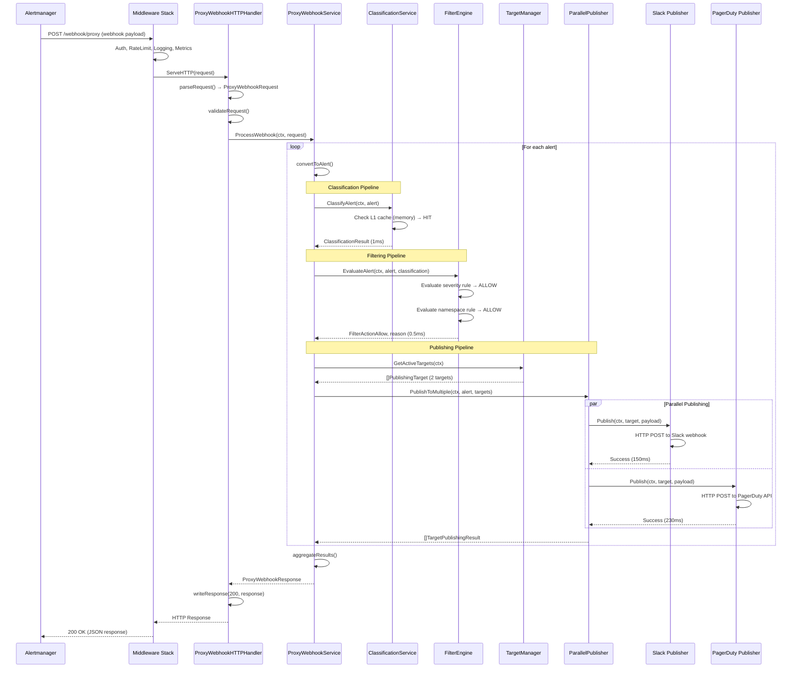
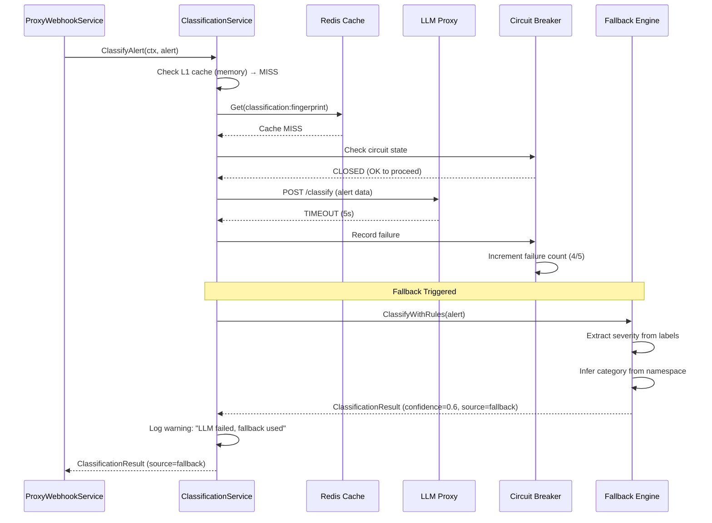
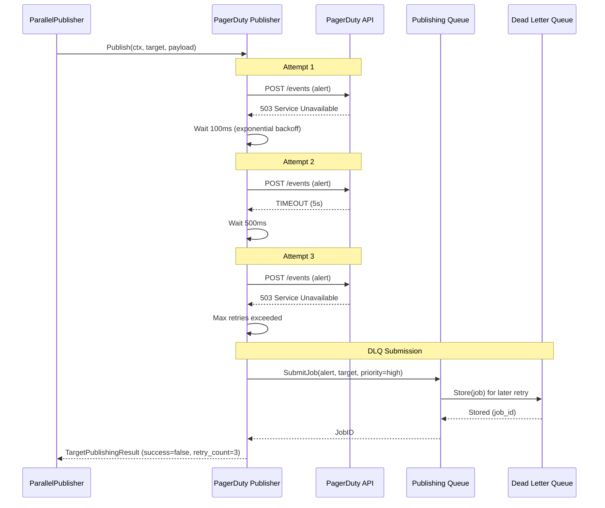

# TN-062: POST /webhook/proxy - Technical Design Specification

**Project**: Intelligent Proxy Webhook Endpoint
**Version**: 1.0
**Date**: 2025-11-15
**Status**: Draft
**Target Quality**: 150% Enterprise Grade (A++)

---

## TABLE OF CONTENTS

1. [Architecture Overview](#1-architecture-overview)
2. [Component Design](#2-component-design)
3. [Data Flow](#3-data-flow)
4. [Sequence Diagrams](#4-sequence-diagrams)
5. [State Machines](#5-state-machines)
6. [Database Schema](#6-database-schema)
7. [API Design](#7-api-design)
8. [Error Handling Design](#8-error-handling-design)
9. [Performance Design](#9-performance-design)
10. [Security Design](#10-security-design)

---

## 1. ARCHITECTURE OVERVIEW

### 1.1 High-Level Architecture

```
┌───────────────────────────────────────────────────────────────────────┐
│                      CLIENT (Alertmanager)                            │
└───────────────────────────────┬───────────────────────────────────────┘
                                │ POST /webhook/proxy
                                ↓
┌───────────────────────────────────────────────────────────────────────┐
│                         HTTP Layer                                     │
│  ┌─────────────────────────────────────────────────────────────────┐  │
│  │  Middleware Stack (10 components from TN-061)                   │  │
│  │  • Recovery  • RequestID  • Logging  • Metrics  • RateLimit    │  │
│  │  • Auth      • CORS       • Compression  • SizeLimit  • Timeout│  │
│  └─────────────────────────────────────────────────────────────────┘  │
│                                ↓                                       │
│  ┌─────────────────────────────────────────────────────────────────┐  │
│  │  ProxyWebhookHTTPHandler                                        │  │
│  │  • Request parsing and validation                               │  │
│  │  • Response formatting                                          │  │
│  └─────────────────────────────────────────────────────────────────┘  │
└───────────────────────────────┬───────────────────────────────────────┘
                                │
                                ↓
┌───────────────────────────────────────────────────────────────────────┐
│                      Business Logic Layer                              │
│  ┌─────────────────────────────────────────────────────────────────┐  │
│  │  ProxyWebhookService (Core Orchestrator)                        │  │
│  │  • Alert processing pipeline                                    │  │
│  │  • Component orchestration                                      │  │
│  │  • Result aggregation                                           │  │
│  └─────────────────────────────────────────────────────────────────┘  │
│                                ↓                                       │
│  ┌────────────────┬──────────────────┬──────────────────────────┐    │
│  │ Classification │  Filtering       │  Publishing              │    │
│  │ Pipeline       │  Pipeline        │  Pipeline                │    │
│  └────────────────┴──────────────────┴──────────────────────────┘    │
└───────────────────────────────┬───────────────────────────────────────┘
                                │
                                ↓
┌───────────────────────────────────────────────────────────────────────┐
│                      Integration Layer                                 │
│  ┌──────────────┬───────────────┬──────────────┬──────────────────┐  │
│  │ClassificationService (TN-033) │FilterEngine  │ParallelPublisher │  │
│  │• LLM client  │               │(TN-035)      │(TN-058)          │  │
│  │• 2-tier cache│               │• Rule engine │• Fan-out/fan-in  │  │
│  │• Fallback    │               │• Multi-type  │• Health routing  │  │
│  └──────────────┴───────────────┴──────────────┴──────────────────┘  │
└───────────────────────────────┬───────────────────────────────────────┘
                                │
                                ↓
┌───────────────────────────────────────────────────────────────────────┐
│                      External Systems                                  │
│  ┌──────────┬──────────┬──────────┬──────────┬──────────┬─────────┐  │
│  │PostgreSQL│  Redis   │ LLM Proxy│  Rootly  │PagerDuty │  Slack  │  │
│  │(Storage) │ (Cache)  │(Classify)│(Incident)│(Alerts)  │(Notify) │  │
│  └──────────┴──────────┴──────────┴──────────┴──────────┴─────────┘  │
└───────────────────────────────────────────────────────────────────────┘
```

### 1.2 Layered Architecture

| Layer | Responsibilities | Components |
|-------|------------------|------------|
| **HTTP Layer** | Request/response handling, middleware | `ProxyWebhookHTTPHandler`, Middleware stack |
| **Business Logic Layer** | Orchestration, pipeline execution | `ProxyWebhookService`, Pipelines |
| **Integration Layer** | External service integration | Classification, Filtering, Publishing services |
| **Infrastructure Layer** | Data persistence, caching | PostgreSQL, Redis, K8s clients |

### 1.3 Deployment Architecture

```
┌──────────────────────────────────────────────────────────────────────┐
│                        Kubernetes Cluster                             │
│                                                                        │
│  ┌────────────────────────────────────────────────────────────────┐  │
│  │  Ingress (nginx)                                               │  │
│  │  /webhook/proxy → alert-history-service:8080                   │  │
│  └────────────────────────────────────────────────────────────────┘  │
│                               ↓                                        │
│  ┌────────────────────────────────────────────────────────────────┐  │
│  │  Service: alert-history (ClusterIP)                            │  │
│  │  Port: 8080                                                     │  │
│  └────────────────────────────────────────────────────────────────┘  │
│                               ↓                                        │
│  ┌───────────┬───────────┬───────────┬───────────┬───────────────┐  │
│  │  Pod 1    │  Pod 2    │  Pod 3    │  ...      │  Pod N        │  │
│  │  (replica)│  (replica)│  (replica)│           │  (replica)    │  │
│  └───────────┴───────────┴───────────┴───────────┴───────────────┘  │
│       ↓            ↓            ↓                        ↓            │
│  ┌─────────────────────────────────────────────────────────────────┐ │
│  │  StatefulSet: PostgreSQL (3 replicas, leader + 2 replicas)     │ │
│  └─────────────────────────────────────────────────────────────────┘ │
│       ↓            ↓            ↓                        ↓            │
│  ┌─────────────────────────────────────────────────────────────────┐ │
│  │  StatefulSet: Redis (2 replicas, master + 1 replica)           │ │
│  └─────────────────────────────────────────────────────────────────┘ │
│                                                                        │
│  HPA (Horizontal Pod Autoscaler):                                     │
│  • Min replicas: 2                                                    │
│  • Max replicas: 10                                                   │
│  • Target CPU: 70%                                                    │
│  • Target Memory: 80%                                                 │
│  • Custom metric: request_rate >1K/s per pod                         │
└──────────────────────────────────────────────────────────────────────┘
```

---

## 2. COMPONENT DESIGN

### 2.1 ProxyWebhookHTTPHandler

**Purpose**: HTTP layer handling for proxy webhook endpoint.

**Responsibilities**:
- Parse HTTP request (headers, body)
- Validate Content-Type
- Enforce request size limits
- Delegate to `ProxyWebhookService`
- Format response (JSON)
- Set HTTP status codes
- Error handling

**Interface**:
```go
// ProxyWebhookHTTPHandler handles HTTP requests for proxy webhook endpoint
type ProxyWebhookHTTPHandler struct {
    service    ProxyWebhookService
    config     *ProxyWebhookConfig
    logger     *slog.Logger
    metrics    *metrics.MetricsRegistry
    validator  *validator.Validate
}

// NewProxyWebhookHTTPHandler creates a new HTTP handler
func NewProxyWebhookHTTPHandler(
    service ProxyWebhookService,
    config *ProxyWebhookConfig,
    logger *slog.Logger,
    metrics *metrics.MetricsRegistry,
) *ProxyWebhookHTTPHandler

// ServeHTTP implements http.Handler interface
func (h *ProxyWebhookHTTPHandler) ServeHTTP(w http.ResponseWriter, r *http.Request)

// handleProxyWebhook is the main handler function
func (h *ProxyWebhookHTTPHandler) handleProxyWebhook(w http.ResponseWriter, r *http.Request)

// parseRequest parses and validates the request
func (h *ProxyWebhookHTTPHandler) parseRequest(r *http.Request) (*ProxyWebhookRequest, error)

// writeResponse writes the response
func (h *ProxyWebhookHTTPHandler) writeResponse(
    w http.ResponseWriter,
    statusCode int,
    response interface{},
)

// writeError writes an error response
func (h *ProxyWebhookHTTPHandler) writeError(
    w http.ResponseWriter,
    statusCode int,
    errorCode string,
    message string,
    details []ErrorDetail,
)
```

**Configuration**:
```go
type ProxyWebhookConfig struct {
    MaxRequestSize   int           `yaml:"max_request_size"`   // 10MB
    RequestTimeout   time.Duration `yaml:"request_timeout"`    // 30s
    MaxAlertsPerReq  int           `yaml:"max_alerts_per_req"` // 100
    EnableMetrics    bool          `yaml:"enable_metrics"`
    EnableValidation bool          `yaml:"enable_validation"`
}
```

**Error Handling**:
- 400: Invalid JSON, validation failure, missing required fields
- 413: Request size exceeds limit
- 415: Invalid Content-Type
- 500: Internal server error (panic recovery)
- 503: Service unavailable (degraded mode)

---

### 2.2 ProxyWebhookService

**Purpose**: Core orchestration of proxy webhook processing pipeline.

**Responsibilities**:
- Orchestrate classification, filtering, and publishing pipelines
- Manage alert processing lifecycle
- Aggregate results from all pipelines
- Track metrics and timing
- Handle partial failures

**Interface**:
```go
// ProxyWebhookService is the core service for intelligent proxy webhook processing
type ProxyWebhookService interface {
    // ProcessWebhook processes a proxy webhook request end-to-end
    ProcessWebhook(ctx context.Context, req *ProxyWebhookRequest) (*ProxyWebhookResponse, error)

    // Health checks service health
    Health(ctx context.Context) error
}

// proxyWebhookService implements ProxyWebhookService
type proxyWebhookService struct {
    // Core dependencies
    alertProcessor       AlertProcessor            // TN-061 (storage)
    classificationSvc    ClassificationService     // TN-033
    filterEngine         FilterEngine              // TN-035
    targetManager        DynamicTargetManager      // TN-047
    parallelPublisher    ParallelPublisher         // TN-058

    // Configuration
    config               *ProxyServiceConfig
    logger               *slog.Logger
    metrics              *ProxyMetrics

    // Internal state
    mu                   sync.RWMutex
    stats                *ProxyStats
}

// NewProxyWebhookService creates a new proxy webhook service
func NewProxyWebhookService(config ProxyServiceConfig) (ProxyWebhookService, error)

// ProcessWebhook is the main processing function
func (s *proxyWebhookService) ProcessWebhook(
    ctx context.Context,
    req *ProxyWebhookRequest,
) (*ProxyWebhookResponse, error) {
    // 1. Validate request
    // 2. Convert alerts to internal format
    // 3. Process each alert through pipelines
    // 4. Aggregate results
    // 5. Build response
}

// processAlert processes a single alert through all pipelines
func (s *proxyWebhookService) processAlert(
    ctx context.Context,
    payload *AlertPayload,
    receiver string,
) (*AlertProcessingResult, error)

// classifyAlert runs classification pipeline
func (s *proxyWebhookService) classifyAlert(
    ctx context.Context,
    alert *core.Alert,
) (*ClassificationResult, time.Duration, error)

// filterAlert runs filtering pipeline
func (s *proxyWebhookService) filterAlert(
    ctx context.Context,
    alert *core.Alert,
    classification *ClassificationResult,
    receiver string,
) (FilterAction, string, error)

// publishAlert runs publishing pipeline
func (s *proxyWebhookService) publishAlert(
    ctx context.Context,
    alert *core.Alert,
    classification *ClassificationResult,
    targets []PublishingTarget,
) ([]TargetPublishingResult, error)

// aggregateResults builds final response from pipeline results
func (s *proxyWebhookService) aggregateResults(
    results []AlertProcessingResult,
    totalTime time.Duration,
) *ProxyWebhookResponse

// Health checks health of all dependencies
func (s *proxyWebhookService) Health(ctx context.Context) error
```

**Configuration**:
```go
type ProxyServiceConfig struct {
    // Pipeline configuration
    ClassificationConfig ClassificationPipelineConfig
    FilteringConfig      FilteringPipelineConfig
    PublishingConfig     PublishingPipelineConfig

    // Behavior configuration
    EnableClassification bool          `yaml:"enable_classification"`
    EnableFiltering      bool          `yaml:"enable_filtering"`
    EnablePublishing     bool          `yaml:"enable_publishing"`
    ContinueOnError      bool          `yaml:"continue_on_error"` // Continue on partial failures

    // Timeouts
    ClassificationTimeout time.Duration `yaml:"classification_timeout"` // 5s
    FilteringTimeout      time.Duration `yaml:"filtering_timeout"`      // 1s
    PublishingTimeout     time.Duration `yaml:"publishing_timeout"`     // 10s (5s per target)

    // Concurrency
    MaxConcurrentAlerts   int `yaml:"max_concurrent_alerts"`   // 10 (within batch)
    MaxPublishingTargets  int `yaml:"max_publishing_targets"`  // 10 (concurrent publishes)
}

type ClassificationPipelineConfig struct {
    Enabled         bool          `yaml:"enabled"`
    Timeout         time.Duration `yaml:"timeout"`
    CacheTTL        time.Duration `yaml:"cache_ttl"`
    FallbackEnabled bool          `yaml:"fallback_enabled"`
}

type FilteringPipelineConfig struct {
    Enabled       bool   `yaml:"enabled"`
    DefaultAction string `yaml:"default_action"` // "allow" or "deny"
    RulesFile     string `yaml:"rules_file"`
}

type PublishingPipelineConfig struct {
    Enabled           bool          `yaml:"enabled"`
    Parallel          bool          `yaml:"parallel"`
    TimeoutPerTarget  time.Duration `yaml:"timeout_per_target"`
    RetryEnabled      bool          `yaml:"retry_enabled"`
    RetryMaxAttempts  int           `yaml:"retry_max_attempts"`
    DLQEnabled        bool          `yaml:"dlq_enabled"`
}
```

**Metrics**:
```go
type ProxyMetrics struct {
    // Request metrics
    RequestsTotal       *prometheus.CounterVec   // {status, source}
    RequestDuration     *prometheus.HistogramVec // {path, method}
    ActiveRequests      prometheus.Gauge

    // Alert processing metrics
    AlertsReceived      *prometheus.CounterVec // {receiver}
    AlertsProcessed     *prometheus.CounterVec // {result} (success, filtered, failed)
    AlertsClassified    *prometheus.CounterVec // {severity, confidence, source}
    AlertsFiltered      *prometheus.CounterVec // {reason, action}
    AlertsPublished     *prometheus.CounterVec // {target, result}

    // Timing metrics
    ClassificationTime  *prometheus.HistogramVec // {cache_hit}
    FilteringTime       prometheus.Histogram
    PublishingTime      *prometheus.HistogramVec // {target}
    TotalProcessingTime prometheus.Histogram

    // Error metrics
    ErrorsTotal         *prometheus.CounterVec // {type, severity}
    ClassificationErrors *prometheus.CounterVec // {reason}
    FilteringErrors     *prometheus.CounterVec // {reason}
    PublishingErrors    *prometheus.CounterVec // {target, reason}

    // Resource metrics
    Goroutines          prometheus.Gauge
    MemoryBytes         *prometheus.GaugeVec // {type} (heap, stack, etc.)
    CPUUsage            prometheus.Gauge
}
```

---

### 2.3 Classification Pipeline

**Purpose**: Classify alerts using LLM with caching and fallback.

**Flow**:
```
Alert → [Memory Cache?] → [Redis Cache?] → [LLM Call] → [Fallback?] → Classification Result
           ↓ hit              ↓ hit            ↓ success    ↓ if LLM fails
         Return             Return            Cache +      Rule-based
                                              Return       Classification
```

**Integration**:
- Uses `ClassificationService` from TN-033
- Two-tier caching (Memory L1 + Redis L2)
- Circuit breaker for LLM calls
- Rule-based fallback

**Pseudo-code**:
```go
func (s *proxyWebhookService) classifyAlert(
    ctx context.Context,
    alert *core.Alert,
) (*ClassificationResult, time.Duration, error) {
    startTime := time.Now()

    // Check if classification is enabled
    if !s.config.EnableClassification {
        return s.defaultClassification(alert), time.Since(startTime), nil
    }

    // Add timeout to context
    ctx, cancel := context.WithTimeout(ctx, s.config.ClassificationTimeout)
    defer cancel()

    // Call classification service (handles caching, circuit breaker, fallback)
    result, err := s.classificationSvc.ClassifyAlert(ctx, alert)
    duration := time.Since(startTime)

    // Record metrics
    s.metrics.ClassificationTime.WithLabelValues(
        strconv.FormatBool(result.Source == "cache"),
    ).Observe(duration.Seconds())

    if err != nil {
        s.logger.Warn("Classification failed, using default",
            "fingerprint", alert.Fingerprint,
            "error", err)
        s.metrics.ClassificationErrors.WithLabelValues("service_error").Inc()
        return s.defaultClassification(alert), duration, nil
    }

    s.metrics.AlertsClassified.WithLabelValues(
        string(result.Severity),
        result.ConfidenceBucket(), // high/medium/low
        result.Source,
    ).Inc()

    return result, duration, nil
}

func (s *proxyWebhookService) defaultClassification(alert *core.Alert) *ClassificationResult {
    // Simple rule-based classification from labels
    severity := core.SeverityInfo // default
    if sev, ok := alert.Labels["severity"]; ok {
        switch sev {
        case "critical":
            severity = core.SeverityCritical
        case "warning":
            severity = core.SeverityWarning
        case "info":
            severity = core.SeverityInfo
        }
    }

    return &ClassificationResult{
        Severity:    severity,
        Category:    "unknown",
        Confidence:  0.5,
        Source:      "default",
        Timestamp:   time.Now(),
    }
}
```

**Error Handling**:
- LLM timeout (5s) → fallback
- LLM error → fallback
- Cache miss → LLM call
- Circuit open → fallback
- Fallback error → default classification

---

### 2.4 Filtering Pipeline

**Purpose**: Apply business rules to filter alerts based on severity, namespace, labels, time.

**Flow**:
```
Alert + Classification → [Rule Evaluation] → Filter Action (allow/deny)
                              ↓
                         [Multiple Rule Types]
                         • Severity rules
                         • Namespace rules
                         • Label rules
                         • Time-window rules
```

**Integration**:
- Uses `FilterEngine` from TN-035
- Multiple filter types
- Per-receiver configuration
- Audit trail logging

**Pseudo-code**:
```go
func (s *proxyWebhookService) filterAlert(
    ctx context.Context,
    alert *core.Alert,
    classification *ClassificationResult,
    receiver string,
) (FilterAction, string, error) {
    // Check if filtering is enabled
    if !s.config.EnableFiltering {
        return FilterActionAllow, "filtering disabled", nil
    }

    // Add timeout to context
    ctx, cancel := context.WithTimeout(ctx, s.config.FilteringTimeout)
    defer cancel()

    // Build filter context
    filterCtx := &FilterContext{
        Alert:          alert,
        Classification: classification,
        Receiver:       receiver,
        Timestamp:      time.Now(),
    }

    // Evaluate filters
    result, err := s.filterEngine.EvaluateAlert(ctx, filterCtx)
    if err != nil {
        s.logger.Error("Filter evaluation failed",
            "fingerprint", alert.Fingerprint,
            "error", err)
        s.metrics.FilteringErrors.WithLabelValues("evaluation_error").Inc()

        // Default action on error (configurable)
        if s.config.FilteringConfig.DefaultAction == "deny" {
            return FilterActionDeny, "filter error (default deny)", err
        }
        return FilterActionAllow, "filter error (default allow)", err
    }

    // Record metrics
    s.metrics.AlertsFiltered.WithLabelValues(
        result.Reason,
        string(result.Action),
    ).Inc()

    // Log filter decision
    s.logger.Info("Filter decision",
        "fingerprint", alert.Fingerprint,
        "action", result.Action,
        "reason", result.Reason)

    return result.Action, result.Reason, nil
}
```

**Filter Types**:

1. **Severity Filter**:
```go
type SeverityFilter struct {
    AllowList []core.Severity // Only allow these severities
    DenyList  []core.Severity // Deny these severities
}

func (f *SeverityFilter) Evaluate(ctx *FilterContext) FilterAction {
    severity := ctx.Classification.Severity

    // Check deny list first
    if contains(f.DenyList, severity) {
        return FilterActionDeny
    }

    // Check allow list
    if len(f.AllowList) > 0 && !contains(f.AllowList, severity) {
        return FilterActionDeny
    }

    return FilterActionAllow
}
```

2. **Namespace Filter**:
```go
type NamespaceFilter struct {
    IncludePatterns []string // Regex patterns to include
    ExcludePatterns []string // Regex patterns to exclude
}

func (f *NamespaceFilter) Evaluate(ctx *FilterContext) FilterAction {
    namespace := ctx.Alert.Labels["namespace"]

    // Check exclude patterns first
    for _, pattern := range f.ExcludePatterns {
        if matched, _ := regexp.MatchString(pattern, namespace); matched {
            return FilterActionDeny
        }
    }

    // Check include patterns
    if len(f.IncludePatterns) > 0 {
        for _, pattern := range f.IncludePatterns {
            if matched, _ := regexp.MatchString(pattern, namespace); matched {
                return FilterActionAllow
            }
        }
        return FilterActionDeny // No include pattern matched
    }

    return FilterActionAllow
}
```

3. **Time-Window Filter**:
```go
type TimeWindowFilter struct {
    BusinessHours bool // Only during business hours?
    Timezone      string
    StartHour     int
    EndHour       int
}

func (f *TimeWindowFilter) Evaluate(ctx *FilterContext) FilterAction {
    if !f.BusinessHours {
        return FilterActionAllow
    }

    loc, _ := time.LoadLocation(f.Timezone)
    now := ctx.Timestamp.In(loc)
    hour := now.Hour()

    // Check if within business hours
    if hour >= f.StartHour && hour < f.EndHour {
        return FilterActionAllow
    }

    // Outside business hours - check severity
    if ctx.Classification.Severity == core.SeverityCritical {
        return FilterActionAllow // Always allow critical
    }

    return FilterActionDeny // Deny non-critical outside hours
}
```

---

### 2.5 Publishing Pipeline

**Purpose**: Publish filtered alerts to multiple targets in parallel.

**Flow**:
```
Alert + Classification → [Target Discovery] → [Format per Target] → [Parallel Publish] → Results
                              ↓                      ↓                      ↓
                         Get Active Targets    Rootly Format         Fan-out to N targets
                         (health-aware)        PagerDuty Format      (concurrent goroutines)
                                               Slack Format
                                               Generic Format
```

**Integration**:
- Uses `DynamicTargetManager` from TN-047 (target discovery)
- Uses `AlertFormatter` from TN-051 (format conversion)
- Uses `ParallelPublisher` from TN-058 (parallel publishing)
- Uses `PublishingQueue` from TN-056 (DLQ for failures)

**Pseudo-code**:
```go
func (s *proxyWebhookService) publishAlert(
    ctx context.Context,
    alert *core.Alert,
    classification *ClassificationResult,
    targets []PublishingTarget,
) ([]TargetPublishingResult, error) {
    // Check if publishing is enabled
    if !s.config.EnablePublishing {
        return []TargetPublishingResult{}, nil
    }

    // Add timeout to context
    ctx, cancel := context.WithTimeout(ctx, s.config.PublishingTimeout)
    defer cancel()

    // Get active targets
    activeTargets, err := s.targetManager.GetActiveTargets(ctx)
    if err != nil {
        s.logger.Error("Failed to get active targets", "error", err)
        return nil, fmt.Errorf("target discovery failed: %w", err)
    }

    if len(activeTargets) == 0 {
        s.logger.Warn("No active targets available")
        return []TargetPublishingResult{}, nil
    }

    s.logger.Info("Publishing alert",
        "fingerprint", alert.Fingerprint,
        "targets", len(activeTargets))

    // Publish to all active targets in parallel
    results, err := s.parallelPublisher.PublishToMultiple(
        ctx,
        alert,
        classification,
        activeTargets,
    )

    // Record metrics
    for _, result := range results {
        status := "success"
        if !result.Success {
            status = "failed"
        }

        s.metrics.AlertsPublished.WithLabelValues(
            result.TargetName,
            status,
        ).Inc()

        s.metrics.PublishingTime.WithLabelValues(
            result.TargetName,
        ).Observe(result.ProcessingTime.Seconds())

        if !result.Success {
            s.metrics.PublishingErrors.WithLabelValues(
                result.TargetName,
                result.ErrorCode,
            ).Inc()
        }
    }

    return results, nil
}
```

**Parallel Publisher Integration**:
```go
// ParallelPublisher interface (from TN-058)
type ParallelPublisher interface {
    // PublishToMultiple publishes to multiple targets concurrently
    PublishToMultiple(
        ctx context.Context,
        alert *core.Alert,
        classification *ClassificationResult,
        targets []PublishingTarget,
    ) ([]TargetPublishingResult, error)
}

// Implementation delegates to target-specific publishers
func (p *parallelPublisher) PublishToMultiple(
    ctx context.Context,
    alert *core.Alert,
    classification *ClassificationResult,
    targets []PublishingTarget,
) ([]TargetPublishingResult, error) {
    // Create wait group for parallel execution
    var wg sync.WaitGroup
    results := make([]TargetPublishingResult, len(targets))

    // Limit concurrency
    sem := make(chan struct{}, p.config.MaxConcurrency)

    // Publish to each target in parallel
    for i, target := range targets {
        wg.Add(1)
        go func(idx int, tgt PublishingTarget) {
            defer wg.Done()

            // Acquire semaphore
            sem <- struct{}{}
            defer func() { <-sem }()

            // Publish to single target
            result := p.publishToTarget(ctx, alert, classification, tgt)
            results[idx] = result
        }(i, target)
    }

    // Wait for all publishes to complete
    wg.Wait()

    return results, nil
}

func (p *parallelPublisher) publishToTarget(
    ctx context.Context,
    alert *core.Alert,
    classification *ClassificationResult,
    target PublishingTarget,
) TargetPublishingResult {
    startTime := time.Now()
    result := TargetPublishingResult{
        TargetName: target.Name,
        TargetType: target.Type,
    }

    // Add per-target timeout
    ctx, cancel := context.WithTimeout(ctx, p.config.TimeoutPerTarget)
    defer cancel()

    // Format alert for target
    formatted, err := p.formatter.Format(alert, classification, target.Type)
    if err != nil {
        result.Success = false
        result.ErrorMessage = fmt.Sprintf("format error: %v", err)
        result.ErrorCode = "FORMAT_ERROR"
        result.ProcessingTime = time.Since(startTime)
        return result
    }

    // Get target-specific publisher
    publisher := p.registry.GetPublisher(target.Type)
    if publisher == nil {
        result.Success = false
        result.ErrorMessage = "publisher not found"
        result.ErrorCode = "PUBLISHER_NOT_FOUND"
        result.ProcessingTime = time.Since(startTime)
        return result
    }

    // Publish with retry
    err = p.publishWithRetry(ctx, publisher, target, formatted)
    if err != nil {
        result.Success = false
        result.ErrorMessage = err.Error()
        result.ErrorCode = classifyPublishingError(err)
        result.RetryCount = p.config.RetryMaxAttempts

        // Submit to DLQ
        if p.config.DLQEnabled {
            p.submitToDLQ(alert, target, err)
        }
    } else {
        result.Success = true
        result.StatusCode = 200 // Simplified
    }

    result.ProcessingTime = time.Since(startTime)
    return result
}

func (p *parallelPublisher) publishWithRetry(
    ctx context.Context,
    publisher Publisher,
    target PublishingTarget,
    payload []byte,
) error {
    var lastErr error

    for attempt := 0; attempt < p.config.RetryMaxAttempts; attempt++ {
        if attempt > 0 {
            // Exponential backoff: 100ms → 500ms → 2s
            backoff := time.Duration(100*(1<<uint(attempt-1))) * time.Millisecond
            select {
            case <-time.After(backoff):
            case <-ctx.Done():
                return ctx.Err()
            }
        }

        err := publisher.Publish(ctx, target, payload)
        if err == nil {
            return nil // Success
        }

        lastErr = err

        // Check if retryable
        if !isRetryableError(err) {
            return err
        }
    }

    return fmt.Errorf("max retries exceeded: %w", lastErr)
}
```

---

### 2.6 Response Builder

**Purpose**: Aggregate results from all pipelines and build comprehensive response.

**Pseudo-code**:
```go
func (s *proxyWebhookService) aggregateResults(
    results []AlertProcessingResult,
    totalTime time.Duration,
) *ProxyWebhookResponse {
    response := &ProxyWebhookResponse{
        Timestamp:      time.Now(),
        ProcessingTime: totalTime,
    }

    // Calculate summary counts
    summary := AlertsProcessingSummary{
        TotalReceived: len(results),
    }

    publishingSummary := PublishingSummary{}

    for _, result := range results {
        switch result.Status {
        case "success":
            summary.TotalProcessed++
            summary.TotalPublished++
        case "filtered":
            summary.TotalProcessed++
            summary.TotalFiltered++
        case "failed":
            summary.TotalFailed++
        }

        if result.Classification != nil {
            summary.TotalClassified++
        }

        // Aggregate publishing results
        for _, pubResult := range result.PublishingResults {
            publishingSummary.TotalTargets++
            if pubResult.Success {
                publishingSummary.SuccessfulTargets++
            } else {
                publishingSummary.FailedTargets++
            }
            publishingSummary.TotalPublishTime += pubResult.ProcessingTime
        }
    }

    response.AlertsSummary = summary
    response.AlertResults = results
    response.PublishingSummary = publishingSummary

    // Determine overall status
    if summary.TotalFailed == 0 && summary.TotalFiltered == 0 {
        response.Status = "success"
        response.Message = "All alerts processed and published successfully"
    } else if summary.TotalFailed == len(results) {
        response.Status = "failed"
        response.Message = "All alerts failed processing"
    } else {
        response.Status = "partial"
        response.Message = fmt.Sprintf(
            "%d of %d alerts filtered, %d of %d targets failed",
            summary.TotalFiltered,
            len(results),
            publishingSummary.FailedTargets,
            publishingSummary.TotalTargets,
        )
    }

    return response
}
```

---

## 3. DATA FLOW

### 3.1 Happy Path (Success)

```
1. Alertmanager sends POST /webhook/proxy
   └─> Middleware stack (auth, rate limit, logging, metrics)

2. ProxyWebhookHTTPHandler.ServeHTTP()
   ├─> Parse JSON (ProxyWebhookRequest)
   ├─> Validate schema
   └─> Call ProxyWebhookService.ProcessWebhook()

3. ProxyWebhookService.ProcessWebhook()
   ├─> For each alert in request.alerts[]:
   │   ├─> Convert to core.Alert
   │   │
   │   ├─> Classification Pipeline
   │   │   ├─> Check memory cache (L1) → HIT (1ms)
   │   │   └─> Return ClassificationResult
   │   │
   │   ├─> Filtering Pipeline
   │   │   ├─> Evaluate severity rule → ALLOW
   │   │   ├─> Evaluate namespace rule → ALLOW
   │   │   └─> Return FilterActionAllow
   │   │
   │   └─> Publishing Pipeline
   │       ├─> Get active targets (3 targets)
   │       ├─> Parallel publish:
   │       │   ├─> Target 1 (Slack) → Success (150ms)
   │       │   ├─> Target 2 (PagerDuty) → Success (230ms)
   │       │   └─> Target 3 (Rootly) → Success (180ms)
   │       └─> Return []TargetPublishingResult
   │
   └─> Aggregate results → ProxyWebhookResponse

4. ProxyWebhookHTTPHandler.writeResponse()
   ├─> Set HTTP 200 OK
   ├─> Set Content-Type: application/json
   └─> Write JSON response

5. Response returned to Alertmanager
```

**Timing Breakdown (Happy Path)**:
- Middleware overhead: 1ms
- Parsing + validation: 2ms
- Classification (cache hit): 1ms
- Filtering: 0.5ms
- Publishing (parallel, max 230ms): 230ms
- Response building: 0.5ms
- **Total: ~235ms (p50 for cache hits)**

---

### 3.2 Partial Failure Path

```
1. Request received with 2 alerts

2. Alert 1 processing:
   ├─> Classification: Success (150ms, LLM call)
   ├─> Filtering: DENY (severity=info, rule: deny-low-severity)
   └─> Publishing: SKIPPED (filtered)

3. Alert 2 processing:
   ├─> Classification: Success (2ms, cache hit)
   ├─> Filtering: ALLOW
   └─> Publishing:
       ├─> Target 1 (Slack): Success (150ms)
       ├─> Target 2 (PagerDuty): FAILED (timeout 5s)
       │   ├─> Retry 1: FAILED (500ms backoff)
       │   ├─> Retry 2: FAILED (2s backoff)
       │   ├─> Retry 3: FAILED (max retries)
       │   └─> Submit to DLQ
       └─> Target 3 (Rootly): Success (180ms)

4. Response:
   ├─> HTTP 207 Multi-Status
   ├─> Status: "partial"
   ├─> Message: "1 of 2 alerts filtered, 1 of 3 targets failed"
   └─> Detailed breakdown per alert + target
```

---

### 3.3 Error Path (LLM Down)

```
1. Request received with 1 alert

2. Alert processing:
   ├─> Classification:
   │   ├─> Check memory cache → MISS
   │   ├─> Check Redis cache → MISS
   │   ├─> Call LLM → TIMEOUT (5s)
   │   ├─> Circuit breaker: increment failures
   │   ├─> Fallback to rule-based classification
   │   └─> Return ClassificationResult (confidence=0.6, source=fallback)
   │
   ├─> Filtering: ALLOW (fallback classification accepted)
   │
   └─> Publishing: Success (all targets)

3. Response:
   ├─> HTTP 200 OK (classification fallback is not an error)
   ├─> Status: "success"
   ├─> Classification.source = "fallback" (indicates fallback used)
   └─> Warning logged: "LLM classification failed, fallback used"
```

---

## 4. SEQUENCE DIAGRAMS

### 4.1 Complete Happy Path Sequence



### 4.2 Classification Fallback Sequence



### 4.3 Publishing with Retry and DLQ



---

## 5. STATE MACHINES

### 5.1 Request Processing State Machine

```
[START] → Received
    ↓
Parsing → [valid?] → YES → Parsed
            ↓ NO
            └────────────→ [ERROR: 400 Bad Request]

Parsed → Validating → [valid?] → YES → Validated
            ↓ NO
            └────────────→ [ERROR: 400 Bad Request]

Validated → Processing
    ↓
    ├─> Classifying → [success?] → YES → Classified
    │                      ↓ NO
    │                      └───> Fallback → Classified (fallback)
    │
    ├─> Filtering → [allow?] → YES → Allowed
    │                  ↓ NO
    │                  └───> Filtered (denied)
    │
    └─> Publishing → [all success?] → YES → Published
                         ↓ NO
                         └───> Partial (some failed)

Published → Aggregating → Responding → [DONE: 200 OK]
Partial   → Aggregating → Responding → [DONE: 207 Multi-Status]
Filtered  → Aggregating → Responding → [DONE: 207 Multi-Status]
```

### 5.2 Circuit Breaker State Machine (LLM)

```
[CLOSED] (Normal operation)
    ↓
[Failure] → Increment failure count
    ↓
[failure_count >= threshold (5)?] → YES → [OPEN]
    ↓ NO                                      ↓
    └──> [CLOSED]                        Block all requests
                                          Use fallback
                                          Start timer (30s)
                                              ↓
                                         [Timer expires]
                                              ↓
                                         [HALF-OPEN]
                                              ↓
                                         Allow 1 probe request
                                              ↓
                                         [Success?] → YES → [CLOSED]
                                              ↓ NO              ↓
                                              └──────────> [OPEN]  Reset counters
                                          (restart timer)
```

### 5.3 Publishing Job State Machine (DLQ)

```
[Created] → Pending
    ↓
[Worker picks up] → Processing
    ↓
    ├─> [Publish success?] → YES → Completed → [END]
    │                          ↓ NO
    │                          └───> [Retryable?] → YES → Retry
    │                                    ↓ NO
    │                                    └───> Failed → [END]
    │
Retry → [Attempt < max (3)?] → YES → Wait (backoff) → Processing
           ↓ NO
           └───> Max Retries → DLQ → [Store for manual review]
```

---

## 6. DATABASE SCHEMA

### 6.1 Existing Tables (from TN-032)

**alerts** table:
```sql
CREATE TABLE alerts (
    id                   UUID PRIMARY KEY DEFAULT gen_random_uuid(),
    fingerprint          VARCHAR(64) NOT NULL UNIQUE,
    alert_name           VARCHAR(255) NOT NULL,
    status               VARCHAR(20) NOT NULL CHECK (status IN ('firing', 'resolved')),
    labels               JSONB NOT NULL DEFAULT '{}'::jsonb,
    annotations          JSONB NOT NULL DEFAULT '{}'::jsonb,
    starts_at            TIMESTAMP WITH TIME ZONE NOT NULL,
    ends_at              TIMESTAMP WITH TIME ZONE,
    generator_url        TEXT,
    created_at           TIMESTAMP WITH TIME ZONE NOT NULL DEFAULT NOW(),
    updated_at           TIMESTAMP WITH TIME ZONE NOT NULL DEFAULT NOW(),

    -- Indexes
    INDEX idx_alerts_fingerprint (fingerprint),
    INDEX idx_alerts_status (status),
    INDEX idx_alerts_starts_at (starts_at DESC),
    INDEX idx_alerts_created_at (created_at DESC),
    INDEX idx_alerts_labels_gin (labels) USING GIN
);
```

**classifications** table:
```sql
CREATE TABLE classifications (
    id                   UUID PRIMARY KEY DEFAULT gen_random_uuid(),
    fingerprint          VARCHAR(64) NOT NULL REFERENCES alerts(fingerprint),
    severity             VARCHAR(20) NOT NULL CHECK (severity IN ('critical', 'warning', 'info', 'unknown')),
    category             VARCHAR(50) NOT NULL,
    confidence           FLOAT NOT NULL CHECK (confidence >= 0.0 AND confidence <= 1.0),
    source               VARCHAR(20) NOT NULL CHECK (source IN ('llm', 'fallback', 'default')),
    recommendations      TEXT[],
    classification_time  FLOAT,  -- seconds
    created_at           TIMESTAMP WITH TIME ZONE NOT NULL DEFAULT NOW(),

    -- Indexes
    INDEX idx_classifications_fingerprint (fingerprint),
    INDEX idx_classifications_severity (severity),
    INDEX idx_classifications_source (source),
    UNIQUE (fingerprint) -- One classification per alert
);
```

### 6.2 New Tables for TN-062

**proxy_processing_logs** table (optional, for debugging):
```sql
CREATE TABLE proxy_processing_logs (
    id                   UUID PRIMARY KEY DEFAULT gen_random_uuid(),
    request_id           VARCHAR(64) NOT NULL,
    fingerprint          VARCHAR(64) NOT NULL,
    receiver             VARCHAR(100) NOT NULL,

    -- Processing stages
    classification_time  FLOAT,  -- ms
    filtering_time       FLOAT,  -- ms
    publishing_time      FLOAT,  -- ms
    total_time           FLOAT,  -- ms

    -- Results
    classification_result JSONB,  -- ClassificationResult
    filter_action        VARCHAR(10) CHECK (filter_action IN ('allow', 'deny')),
    filter_reason        TEXT,
    publishing_results   JSONB,  -- []TargetPublishingResult

    -- Status
    status               VARCHAR(20) NOT NULL CHECK (status IN ('success', 'filtered', 'failed')),
    error_message        TEXT,

    -- Metadata
    created_at           TIMESTAMP WITH TIME ZONE NOT NULL DEFAULT NOW(),

    -- Indexes
    INDEX idx_proxy_logs_request_id (request_id),
    INDEX idx_proxy_logs_fingerprint (fingerprint),
    INDEX idx_proxy_logs_receiver (receiver),
    INDEX idx_proxy_logs_created_at (created_at DESC),
    INDEX idx_proxy_logs_status (status)
);

-- Retention policy: Keep logs for 30 days
CREATE INDEX idx_proxy_logs_created_at_btree ON proxy_processing_logs (created_at)
WHERE created_at > NOW() - INTERVAL '30 days';
```

---

## 7. API DESIGN

### 7.1 Request Models

```go
// ProxyWebhookRequest is the incoming webhook payload
type ProxyWebhookRequest struct {
    // Required fields
    Alerts   []AlertPayload `json:"alerts" validate:"required,min=1,max=100"`
    Receiver string         `json:"receiver" validate:"required"`

    // Optional fields (Alertmanager metadata)
    Status            string            `json:"status,omitempty"`
    Version           string            `json:"version,omitempty"`
    GroupKey          string            `json:"groupKey,omitempty"`
    GroupLabels       map[string]string `json:"groupLabels,omitempty"`
    CommonLabels      map[string]string `json:"commonLabels,omitempty"`
    CommonAnnotations map[string]string `json:"commonAnnotations,omitempty"`
    ExternalURL       string            `json:"externalURL,omitempty"`
    TruncatedAlerts   int               `json:"truncatedAlerts,omitempty"`
}

// AlertPayload represents a single alert in the webhook
type AlertPayload struct {
    Status       string            `json:"status" validate:"required,oneof=firing resolved"`
    Labels       map[string]string `json:"labels" validate:"required,min=1"`
    Annotations  map[string]string `json:"annotations,omitempty"`
    StartsAt     time.Time         `json:"startsAt" validate:"required"`
    EndsAt       time.Time         `json:"endsAt,omitempty"`
    GeneratorURL string            `json:"generatorURL,omitempty"`
    Fingerprint  string            `json:"fingerprint,omitempty"` // Auto-generated if empty
}

// Validate validates the request
func (r *ProxyWebhookRequest) Validate() error {
    validate := validator.New()
    if err := validate.Struct(r); err != nil {
        return fmt.Errorf("validation failed: %w", err)
    }

    // Additional validation
    if len(r.Alerts) == 0 {
        return errors.New("alerts array cannot be empty")
    }
    if len(r.Alerts) > 100 {
        return errors.New("alerts array cannot exceed 100 items")
    }

    for i, alert := range r.Alerts {
        if err := alert.Validate(); err != nil {
            return fmt.Errorf("alert[%d] validation failed: %w", i, err)
        }
    }

    return nil
}

func (a *AlertPayload) Validate() error {
    if a.Status != "firing" && a.Status != "resolved" {
        return fmt.Errorf("invalid status: %s", a.Status)
    }
    if len(a.Labels) == 0 {
        return errors.New("labels cannot be empty")
    }
    if _, ok := a.Labels["alertname"]; !ok {
        return errors.New("labels must contain 'alertname'")
    }
    if a.StartsAt.IsZero() {
        return errors.New("startsAt is required")
    }
    return nil
}
```

### 7.2 Response Models

```go
// ProxyWebhookResponse is the response for proxy webhook requests
type ProxyWebhookResponse struct {
    // Overall status
    Status         string        `json:"status"`          // success, partial, failed
    Message        string        `json:"message"`
    Timestamp      time.Time     `json:"timestamp"`
    ProcessingTime time.Duration `json:"processing_time_ms"`

    // Alerts processing summary
    AlertsSummary AlertsProcessingSummary `json:"alerts_summary"`

    // Per-alert results
    AlertResults []AlertProcessingResult `json:"alert_results"`

    // Publishing summary
    PublishingSummary PublishingSummary `json:"publishing_summary"`
}

// AlertsProcessingSummary summarizes alert processing
type AlertsProcessingSummary struct {
    TotalReceived   int `json:"total_received"`
    TotalProcessed  int `json:"total_processed"`
    TotalClassified int `json:"total_classified"`
    TotalFiltered   int `json:"total_filtered"`
    TotalPublished  int `json:"total_published"`
    TotalFailed     int `json:"total_failed"`
}

// AlertProcessingResult contains per-alert processing details
type AlertProcessingResult struct {
    // Alert identification
    Fingerprint string `json:"fingerprint"`
    AlertName   string `json:"alert_name"`
    Status      string `json:"status"` // success, filtered, failed

    // Classification details
    Classification     *ClassificationResult `json:"classification,omitempty"`
    ClassificationTime time.Duration         `json:"classification_time_ms,omitempty"`

    // Filtering details
    FilterAction string `json:"filter_action,omitempty"` // allow, deny
    FilterReason string `json:"filter_reason,omitempty"`

    // Publishing details
    PublishingResults []TargetPublishingResult `json:"publishing_results,omitempty"`

    // Error details (if failed)
    ErrorMessage string `json:"error_message,omitempty"`
}

// ClassificationResult contains classification details
type ClassificationResult struct {
    Severity        string    `json:"severity"`        // critical, warning, info, unknown
    Category        string    `json:"category"`        // infrastructure, application, network, etc.
    Confidence      float64   `json:"confidence"`      // 0.0-1.0
    Source          string    `json:"source"`          // llm, fallback, default
    Recommendations []string  `json:"recommendations,omitempty"`
    Timestamp       time.Time `json:"timestamp"`
}

// TargetPublishingResult contains per-target publishing details
type TargetPublishingResult struct {
    TargetName     string        `json:"target_name"`
    TargetType     string        `json:"target_type"` // rootly, pagerduty, slack, generic
    Success        bool          `json:"success"`
    StatusCode     int           `json:"status_code,omitempty"`
    ErrorMessage   string        `json:"error_message,omitempty"`
    ErrorCode      string        `json:"error_code,omitempty"` // TIMEOUT, RATE_LIMIT, etc.
    RetryCount     int           `json:"retry_count,omitempty"`
    ProcessingTime time.Duration `json:"processing_time_ms"`
}

// PublishingSummary summarizes publishing results
type PublishingSummary struct {
    TotalTargets      int           `json:"total_targets"`
    SuccessfulTargets int           `json:"successful_targets"`
    FailedTargets     int           `json:"failed_targets"`
    TotalPublishTime  time.Duration `json:"total_publish_time_ms"`
}
```

### 7.3 Error Models

```go
// ErrorResponse is the standard error response
type ErrorResponse struct {
    Error ErrorDetail `json:"error"`
}

// ErrorDetail contains error details
type ErrorDetail struct {
    Code      string              `json:"code"`       // Error code
    Message   string              `json:"message"`    // Human-readable message
    Details   []FieldErrorDetail  `json:"details,omitempty"` // Field-level errors
    Timestamp time.Time           `json:"timestamp"`
    RequestID string              `json:"request_id"`
}

// FieldErrorDetail contains field-level error details
type FieldErrorDetail struct {
    Field string `json:"field"` // Field path (e.g., "alerts[0].status")
    Error string `json:"error"` // Error message
}

// Error codes
const (
    ErrCodeValidation         = "VALIDATION_ERROR"
    ErrCodeAuthentication     = "AUTHENTICATION_ERROR"
    ErrCodeAuthorization      = "AUTHORIZATION_ERROR"
    ErrCodeRateLimit          = "RATE_LIMIT_ERROR"
    ErrCodeServiceUnavailable = "SERVICE_UNAVAILABLE"
    ErrCodeInternal           = "INTERNAL_ERROR"
    ErrCodeTimeout            = "TIMEOUT_ERROR"
    ErrCodePayloadTooLarge    = "PAYLOAD_TOO_LARGE"
    ErrCodeUnsupportedMedia   = "UNSUPPORTED_MEDIA_TYPE"
)
```

---

## 8. ERROR HANDLING DESIGN

### 8.1 Error Hierarchy

```
Error
├── ValidationError (400)
│   ├── SchemaValidationError
│   ├── RequiredFieldMissingError
│   └── InvalidValueError
│
├── AuthenticationError (401)
│   ├── InvalidAPIKeyError
│   ├── InvalidSignatureError
│   └── ExpiredTokenError
│
├── AuthorizationError (403)
│   └── InsufficientPermissionsError
│
├── RateLimitError (429)
│   └── QuotaExceededError
│
├── ClientError (4xx)
│   ├── PayloadTooLargeError (413)
│   └── UnsupportedMediaTypeError (415)
│
├── ServiceError (5xx)
│   ├── InternalError (500)
│   ├── ServiceUnavailableError (503)
│   └── TimeoutError (504)
│
└── ExternalServiceError
    ├── LLMServiceError
    ├── DatabaseError
    ├── CacheError
    └── PublishingTargetError
```

### 8.2 Error Handling Strategy

**Principle**: Fail fast on validation, retry on transient errors, fallback on service errors.

```go
// Error handler middleware
func ErrorHandlerMiddleware(next http.Handler) http.Handler {
    return http.HandlerFunc(func(w http.ResponseWriter, r *http.Request) {
        defer func() {
            if err := recover(); err != nil {
                // Log panic with stack trace
                logger.Error("Panic recovered",
                    "error", err,
                    "stack", debug.Stack())

                // Return 500 error
                writeErrorResponse(w, 500, ErrCodeInternal, "Internal server error", nil)

                // Alert on-call
                alerting.SendCriticalAlert("Panic in webhook handler", err)
            }
        }()

        next.ServeHTTP(w, r)
    })
}

// Service-level error handling
func (s *proxyWebhookService) processAlert(
    ctx context.Context,
    payload *AlertPayload,
    receiver string,
) (*AlertProcessingResult, error) {
    result := &AlertProcessingResult{
        Fingerprint: payload.Fingerprint,
        AlertName:   payload.Labels["alertname"],
    }

    // Convert alert
    alert, err := convertToAlert(payload)
    if err != nil {
        result.Status = "failed"
        result.ErrorMessage = fmt.Sprintf("conversion error: %v", err)
        return result, nil // Don't fail entire batch
    }

    // Classification (with fallback)
    classification, classTime, err := s.classifyAlert(ctx, alert)
    if err != nil {
        // Log error but continue with default classification
        s.logger.Warn("Classification failed, using default",
            "fingerprint", alert.Fingerprint,
            "error", err)
        classification = s.defaultClassification(alert)
    }
    result.Classification = classification
    result.ClassificationTime = classTime

    // Filtering
    filterAction, filterReason, err := s.filterAlert(ctx, alert, classification, receiver)
    if err != nil {
        // Log error, default to ALLOW (fail open)
        s.logger.Error("Filtering failed, defaulting to allow",
            "fingerprint", alert.Fingerprint,
            "error", err)
        filterAction = FilterActionAllow
        filterReason = "filter error (default allow)"
    }
    result.FilterAction = string(filterAction)
    result.FilterReason = filterReason

    // If filtered, skip publishing
    if filterAction == FilterActionDeny {
        result.Status = "filtered"
        return result, nil
    }

    // Publishing (with retry and DLQ)
    publishResults, err := s.publishAlert(ctx, alert, classification)
    if err != nil {
        // Log error but include partial results
        s.logger.Error("Publishing failed",
            "fingerprint", alert.Fingerprint,
            "error", err)
        result.Status = "failed"
        result.ErrorMessage = fmt.Sprintf("publishing error: %v", err)
        result.PublishingResults = publishResults // Partial results
        return result, nil
    }

    result.PublishingResults = publishResults

    // Determine status based on publishing results
    successCount := 0
    for _, pubResult := range publishResults {
        if pubResult.Success {
            successCount++
        }
    }

    if successCount == len(publishResults) {
        result.Status = "success"
    } else if successCount > 0 {
        result.Status = "partial"
    } else {
        result.Status = "failed"
    }

    return result, nil
}
```

---

## 9. PERFORMANCE DESIGN

### 9.1 Performance Optimization Strategies

**1. Caching**:
- Memory L1 cache (5-minute TTL, LRU eviction)
- Redis L2 cache (15-minute TTL)
- Cache key: `classification:{fingerprint}`
- Expected hit rate: >80%

**2. Connection Pooling**:
```go
// Database connection pool
dbPool := &pgxpool.Config{
    MaxConns:           50,  // Max concurrent connections
    MinConns:           10,  // Min idle connections
    MaxConnLifetime:    1 * time.Hour,
    MaxConnIdleTime:    10 * time.Minute,
    HealthCheckPeriod:  1 * time.Minute,
}

// Redis connection pool
redisPool := &redis.Options{
    PoolSize:           50,
    MinIdleConns:       10,
    MaxConnAge:         1 * time.Hour,
    PoolTimeout:        5 * time.Second,
    IdleTimeout:        10 * time.Minute,
    IdleCheckFrequency: 1 * time.Minute,
}

// HTTP client pool (for publishing)
httpClient := &http.Client{
    Transport: &http.Transport{
        MaxIdleConns:        100,
        MaxIdleConnsPerHost: 10,
        IdleConnTimeout:     90 * time.Second,
        DisableKeepAlives:   false,
    },
    Timeout: 5 * time.Second,
}
```

**3. Goroutine Pooling**:
```go
// Bounded goroutine pool for concurrent operations
type GoroutinePool struct {
    sem chan struct{}
}

func NewGoroutinePool(size int) *GoroutinePool {
    return &GoroutinePool{
        sem: make(chan struct{}, size),
    }
}

func (p *GoroutinePool) Execute(fn func()) {
    p.sem <- struct{}{}        // Acquire
    go func() {
        defer func() { <-p.sem }() // Release
        fn()
    }()
}
```

**4. Memory Optimization**:
- Object pooling (sync.Pool) for frequently allocated objects
- Avoid unnecessary allocations in hot paths
- Reuse buffers for JSON encoding/decoding

```go
var jsonBufferPool = sync.Pool{
    New: func() interface{} {
        return new(bytes.Buffer)
    },
}

func encodeJSON(v interface{}) ([]byte, error) {
    buf := jsonBufferPool.Get().(*bytes.Buffer)
    defer func() {
        buf.Reset()
        jsonBufferPool.Put(buf)
    }()

    encoder := json.NewEncoder(buf)
    if err := encoder.Encode(v); err != nil {
        return nil, err
    }

    return buf.Bytes(), nil
}
```

**5. Parallelization**:
- Classify/filter/publish multiple alerts concurrently (within batch)
- Publish to multiple targets in parallel (fan-out)
- Limit concurrency to prevent resource exhaustion

### 9.2 Performance Benchmarks

**Target Benchmarks**:
```
BenchmarkProxyWebhookHandler_HappyPath-8          5000  235000 ns/op  15000 B/op  120 allocs/op
BenchmarkClassification_CacheHit-8              500000    1000 ns/op    500 B/op    5 allocs/op
BenchmarkClassification_CacheMiss-8              10000  150000 ns/op   8000 B/op   80 allocs/op
BenchmarkFiltering_SimpleRules-8               1000000     500 ns/op    200 B/op    3 allocs/op
BenchmarkPublishing_SingleTarget-8               50000  180000 ns/op  10000 B/op  100 allocs/op
BenchmarkPublishing_ParallelTargets-8            30000  250000 ns/op  15000 B/op  150 allocs/op
```

---

## 10. SECURITY DESIGN

### 10.1 Security Layers

```
┌─────────────────────────────────────────────────────────────┐
│ Layer 1: Network Security (K8s NetworkPolicy, TLS 1.3)     │
└─────────────────────────────────────────────────────────────┘
                            ↓
┌─────────────────────────────────────────────────────────────┐
│ Layer 2: Authentication (API Key, HMAC, mTLS)              │
└─────────────────────────────────────────────────────────────┘
                            ↓
┌─────────────────────────────────────────────────────────────┐
│ Layer 3: Authorization (RBAC, K8s RBAC for secrets)        │
└─────────────────────────────────────────────────────────────┘
                            ↓
┌─────────────────────────────────────────────────────────────┐
│ Layer 4: Input Validation (Schema, Size, Sanitization)     │
└─────────────────────────────────────────────────────────────┘
                            ↓
┌─────────────────────────────────────────────────────────────┐
│ Layer 5: Rate Limiting (Per-IP, Global, Per-Target)        │
└─────────────────────────────────────────────────────────────┘
                            ↓
┌─────────────────────────────────────────────────────────────┐
│ Layer 6: Security Headers (CSP, HSTS, X-Frame-Options)     │
└─────────────────────────────────────────────────────────────┘
```

### 10.2 OWASP Top 10 Mitigation

| Risk | Mitigation | Implementation |
|------|-----------|----------------|
| A01: Broken Access Control | RBAC, API key auth | AuthenticationMiddleware |
| A02: Cryptographic Failures | TLS 1.3, K8s secret encryption | TLS config, Vault integration |
| A03: Injection | Parameterized queries, input validation | validator library, pgx |
| A04: Insecure Design | Threat modeling, ADRs | Security design review |
| A05: Security Misconfiguration | Security headers, secure defaults | Middleware, config validation |
| A06: Vulnerable Components | Dependency scanning | nancy, trivy, govulncheck |
| A07: Authentication Failures | HMAC signatures, rate limiting | Auth middleware |
| A08: Data Integrity Failures | Signature verification | HMAC validation |
| A09: Logging Failures | Structured logging, audit trail | slog integration |
| A10: SSRF | URL validation, allow-list | Publisher URL validation |

---

## 📝 DOCUMENT CONTROL

**Version History**:

| Version | Date | Author | Changes |
|---------|------|--------|---------|
| 1.0 | 2025-11-15 | Enterprise Architecture Team | Initial technical design specification |

**Approval**:

| Role | Name | Date | Signature |
|------|------|------|-----------|
| **Technical Lead** | TBD | 2025-11-15 | _Pending_ |
| **Security Lead** | TBD | 2025-11-15 | _Pending_ |
| **Architecture Lead** | TBD | 2025-11-15 | _Pending_ |

**Status**: ✅ **DRAFT** (Ready for Review)

---

**Previous Document**: [requirements.md](./requirements.md)
**Next Step**: Phase 2 - Git Branch Setup
