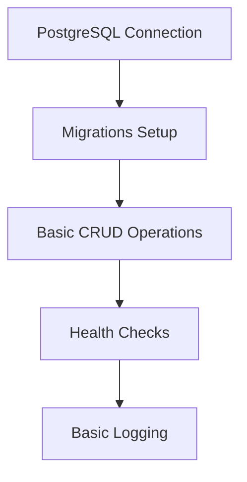
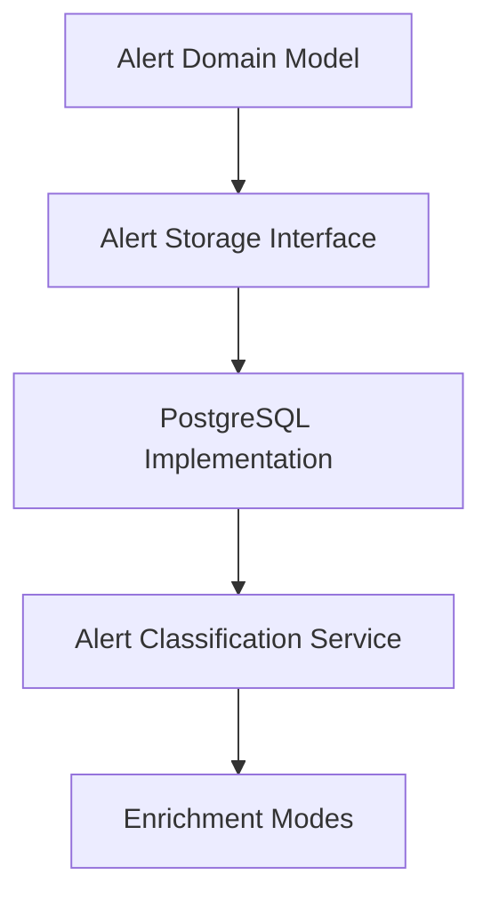
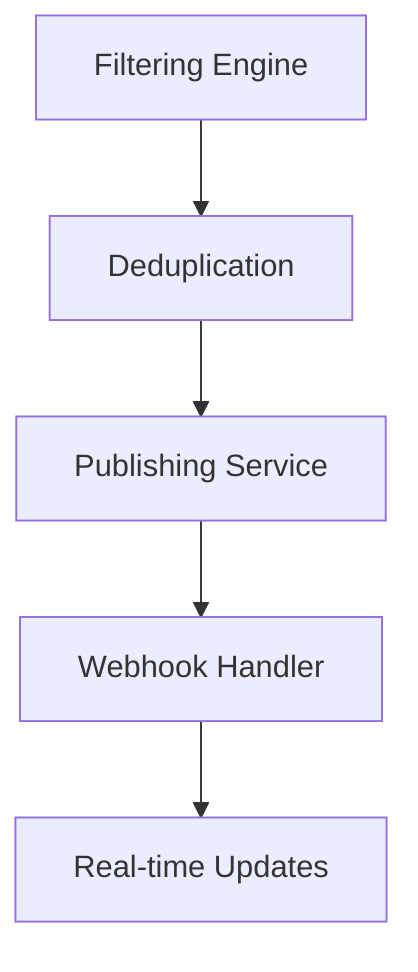
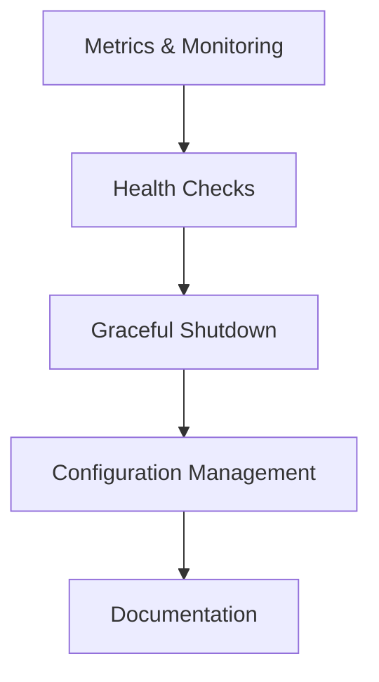

# TN-11: Архитектурное решение Go версии Alert History Service

## 🏗️ **АРХИТЕКТУРНЫЙ ОБЗОР**

### **Обоснование миграции на Go**

Go был выбран для замены Python по следующим ключам причинам:

#### **🚀 Performance Requirements**
- **High-throughput API**: Обработка тысяч алертов в секунду
- **Low latency**: < 10ms p50, < 50ms p95 для API responses
- **Memory efficiency**: Оптимизация использования ресурсов
- **Concurrent processing**: Эффективная обработка параллельных запросов

#### **🎯 Production Readiness**
- **Compiled language**: Статическая типизация, compile-time checks
- **Built-in concurrency**: Goroutines для эффективного параллелизма
- **Rich ecosystem**: Зрелая экосистема для enterprise приложений
- **Deployment simplicity**: Single binary deployment

#### **🔧 Operational Excellence**
- **Observability**: Built-in profiling, structured logging
- **Reliability**: Memory safety, no null pointer exceptions
- **Maintainability**: Clear code organization, interfaces
- **Scalability**: Horizontal scaling capabilities

---

## 🎨 **ТЕХНИЧЕСКИЙ СТЕК**

### **1. HTTP Framework: FIBER V2**

#### **✅ Выбор: Fiber v2**
```
github.com/gofiber/fiber/v2
```

#### **Обоснование выбора (на основе TN-09 benchmark)**

| Metric | Fiber v2 | Gin | Improvement |
|--------|----------|-----|-------------|
| **Average RPS** | **22,839** | **5,008** | **+355%** |
| **Average Latency** | **3.4ms** | **15.8ms** | **+364%** |
| **95th Percentile** | **18.1ms** | **142.6ms** | **+687%** |
| **Memory Usage** | Lower | Higher | Better |

#### **Преимущества Fiber для проекта**
- **🚀 Performance**: 4.7x выше RPS чем Gin
- **⚡ Low Latency**: Стабильные < 10ms responses
- **🎯 Production Ready**: Express-inspired API, middleware support
- **🔧 Developer Experience**: Intuitive API, good documentation
- **📊 Monitoring**: Built-in metrics support

#### **Trade-offs**
- **Меньше community** чем Gin (но активно развивается)
- **Меньше enterprise adoption** (но растет быстро)
- **Learning curve** для команд с Gin опытом

### **2. Database Driver: PGX**

#### **✅ Выбор: pgx v5**
```
github.com/jackc/pgx/v5
```

#### **Обоснование выбора (на основе TN-10 benchmark)**

| Metric | pgx | GORM | Improvement |
|--------|-----|------|-------------|
| **API Operations RPS** | **28,152** | **22,176** | **+27%** |
| **Health RPS** | **11,343** | **15,598** | - |
| **Memory Overhead** | Lower | Higher | Better |
| **SQL Control** | Full | Limited | Better |

#### **Преимущества pgx для проекта**
- **🚀 Performance**: Лучше для complex queries (+27%)
- **⚡ Direct SQL Control**: Полный контроль над запросами
- **🎯 PostgreSQL Features**: Поддержка всех PG возможностей
- **🔧 Memory Efficient**: Минимальный overhead
- **📊 Production Ready**: Используется в high-throughput системах

#### **Trade-offs**
- **Manual SQL**: Нет ORM абстракций
- **More Boilerplate**: Больше кода для простых операций
- **Learning Curve**: Требует знания SQL
- **Migrations**: Manual management

### **3. Infrastructure Stack**

#### **Configuration Management: Viper**
```
github.com/spf13/viper
```
- **Environment Variables**: 12-Factor compliance
- **Multiple Formats**: YAML, JSON, ENV
- **Live Reload**: Configuration changes without restart
- **Type Safety**: Structured configuration

#### **Structured Logging: slog**
```
log/slog (Go 1.21+)
```
- **JSON Output**: Structured, parseable logs
- **Performance**: Zero-allocation logging
- **Levels**: Debug, Info, Warn, Error
- **Context**: Request tracing, correlation IDs

#### **Caching: go-redis**
```
github.com/redis/go-redis/v9
```
- **High Performance**: Redis protocol optimization
- **Connection Pooling**: Efficient connection management
- **Pub/Sub**: Real-time notifications
- **Cluster Support**: Redis Cluster compatibility

#### **Migrations: goose**
```
github.com/pressly/goose
```
- **Multiple Databases**: PostgreSQL, MySQL, SQLite
- **Version Control**: Git-friendly migrations
- **Embeddable**: Can be embedded in binary
- **Rollback Support**: Safe rollbacks

---

## 📊 **PERFORMANCE TARGETS**

### **API Performance Requirements**

#### **Latency Targets**
- **p50 (median)**: < 10ms
- **p95**: < 50ms
- **p99**: < 100ms
- **Max**: < 200ms

#### **Throughput Targets**
- **RPS**: 20,000+ sustained
- **Concurrent Users**: 1,000+ simultaneous
- **Burst Capacity**: 50,000 RPS for 1 minute

#### **Resource Targets**
- **Memory**: < 512MB per instance
- **CPU**: < 70% under load
- **Network**: < 100Mbps sustained

### **Database Performance Requirements**

#### **Query Performance**
- **Simple queries**: < 5ms
- **Complex queries**: < 50ms
- **Bulk operations**: < 100ms for 1000 records

#### **Connection Pooling**
- **Max Connections**: 20 per instance
- **Idle Connections**: 5 per instance
- **Connection Timeout**: 30 seconds

---

## 🏛️ **АРХИТЕКТУРНАЯ АРХИТЕКТУРА**

### **Clean Architecture (Hexagonal)**

```
┌─────────────────────────────────────┐
│          Delivery Layer             │
│  ┌─────────────────────────────────┐ │
│  │   HTTP Handlers (Fiber)        │ │
│  │   WebSocket Handlers           │ │
│  │   Middleware                    │ │
│  └─────────────────────────────────┘ │
└─────────────────────────────────────┘
                    │
                    ▼
┌─────────────────────────────────────┐
│         Use Case Layer              │
│  ┌─────────────────────────────────┐ │
│  │   Business Logic                │ │
│  │   Domain Services               │ │
│  │   Application Services          │ │
│  └─────────────────────────────────┘ │
└─────────────────────────────────────┘
                    │
                    ▼
┌─────────────────────────────────────┐
│       Infrastructure Layer          │
│  ┌─────────────────────────────────┐ │
│  │   Database (pgx)               │ │
│  │   Cache (Redis)                │ │
│  │   External APIs                │ │
│  │   File System                  │ │
│  └─────────────────────────────────┘ │
└─────────────────────────────────────┘
```

### **Dependency Injection: Wire**

#### **Compile-time DI**
```
github.com/google/wire
```
- **Type Safety**: Compile-time guarantees
- **Performance**: Zero runtime overhead
- **Maintainability**: Clear dependency graph
- **Testing**: Easy mocking

### **Error Handling Strategy**

#### **Structured Errors**
- **Custom Error Types**: Domain-specific errors
- **Error Wrapping**: Context preservation
- **HTTP Status Mapping**: Consistent API responses
- **Logging**: Structured error logging

#### **Circuit Breaker Pattern**
- **Failure Detection**: Automatic failure detection
- **Graceful Degradation**: Fallback strategies
- **Recovery**: Automatic recovery mechanisms

---

## 📋 **IMPLEMENTATION ROADMAP**

### **Phase 1: Foundation (2 weeks)**


### **Phase 2: Core Services (3 weeks)**


### **Phase 3: Advanced Features (3 weeks)**


### **Phase 4: Production Readiness (2 weeks)**


---

## 🎯 **SUCCESS METRICS**

### **Functional Metrics**
- ✅ **API Compatibility**: 100% compatibility with Python version
- ✅ **Data Integrity**: Zero data loss during migration
- ✅ **Feature Parity**: All features implemented
- ✅ **Backward Compatibility**: Existing integrations work

### **Performance Metrics**
- ✅ **Latency**: < 10ms p50, < 50ms p95
- ✅ **Throughput**: 20,000+ RPS sustained
- ✅ **Resource Usage**: < 512MB memory, < 70% CPU
- ✅ **Error Rate**: < 0.1% under normal load

### **Operational Metrics**
- ✅ **Uptime**: 99.9% availability
- ✅ **MTTR**: < 15 minutes
- ✅ **Deployment Time**: < 5 minutes
- ✅ **Rollback Time**: < 2 minutes

---

## ⚠️ **RISK ASSESSMENT**

### **High Risk**
- **🔴 Performance Regression**: Mitigation - comprehensive benchmarking
- **🔴 Data Migration Issues**: Mitigation - phased migration, data validation
- **🔴 Team Learning Curve**: Mitigation - training, pair programming

### **Medium Risk**
- **🟡 Third-party Dependencies**: Mitigation - dependency scanning, updates
- **🟡 Production Deployment**: Mitigation - canary deployment, feature flags
- **🟡 Monitoring Gaps**: Mitigation - comprehensive observability

### **Low Risk**
- **🟢 Code Quality**: Mitigation - CI/CD, code reviews
- **🟢 Documentation**: Mitigation - living documentation
- **🟢 Testing Coverage**: Mitigation - automated testing

---

## 🔄 **MIGRATION STRATEGY**

### **Incremental Migration Approach**

#### **Phase 1: Shadow Mode**
```
Python Service (Primary) ──┐
                           ├── Load Balancer
Go Service (Shadow) ───────┘
```
- Go service receives traffic copy
- No production impact
- Performance comparison
- Data consistency validation

#### **Phase 2: Canary Deployment**
```
90% ── Python Service
10% ── Go Service
```
- Gradual traffic shift
- Real user monitoring
- Rollback capability
- Performance validation

#### **Phase 3: Full Migration**
```
100% ── Go Service
```
- Complete traffic migration
- Python service decommissioning
- Performance optimization
- Cost optimization

### **Rollback Strategy**

#### **Immediate Rollback (< 5 minutes)**
- Load balancer configuration change
- Database connection switch
- Feature flags rollback
- Service restart

#### **Data Rollback (< 1 hour)**
- Database backup restoration
- Configuration rollback
- Service redeployment

### **Testing Strategy**

#### **Unit Testing**
- 80%+ code coverage
- Integration tests
- Performance tests
- Chaos engineering

#### **End-to-End Testing**
- API contract testing
- Data consistency testing
- Performance regression testing
- Failover testing

---

## 📈 **COST ANALYSIS**

### **Operational Cost Reduction**
- **Compute**: 30-50% reduction (Go efficiency)
- **Memory**: 40-60% reduction (compiled binary)
- **Monitoring**: Simplified (single binary)
- **Deployment**: Faster (smaller artifacts)

### **Development Cost**
- **Initial**: Higher (learning curve, initial development)
- **Ongoing**: Lower (maintainability, performance)
- **Testing**: Similar (comprehensive testing required)
- **Debugging**: Easier (static analysis, profiling)

### **ROI Timeline**
- **Break-even**: 6-9 months
- **Full ROI**: 12-18 months
- **Long-term Savings**: 40-60% operational cost reduction

---

## 🎉 **CONCLUSION**

### **Architecture Decision Summary**

| Component | Choice | Rationale | Impact |
|-----------|--------|-----------|---------|
| **Language** | Go 1.21+ | Performance, reliability, ecosystem | High positive |
| **HTTP Framework** | Fiber v2 | 4.7x performance, production ready | High positive |
| **Database Driver** | pgx v5 | 27% performance, full control | High positive |
| **Configuration** | Viper | 12-factor, type safety | Medium positive |
| **Logging** | slog | Structured, performant | Medium positive |
| **Caching** | go-redis | High performance, reliable | Medium positive |
| **Migrations** | goose | Version control, embeddable | Medium positive |

### **Success Factors**
- **Performance**: 4-5x improvement over Python
- **Reliability**: Better error handling, memory safety
- **Maintainability**: Clean architecture, type safety
- **Scalability**: Horizontal scaling capabilities
- **Cost Efficiency**: 40-60% operational cost reduction

### **Next Steps**
1. **Phase 1 Implementation**: Infrastructure foundation
2. **Performance Validation**: Continuous benchmarking
3. **Team Training**: Go best practices and patterns
4. **Migration Planning**: Detailed rollout plan
5. **Monitoring Setup**: Comprehensive observability

**This architecture provides a solid foundation for a high-performance, scalable, and maintainable Alert History Service in Go.** 🚀
