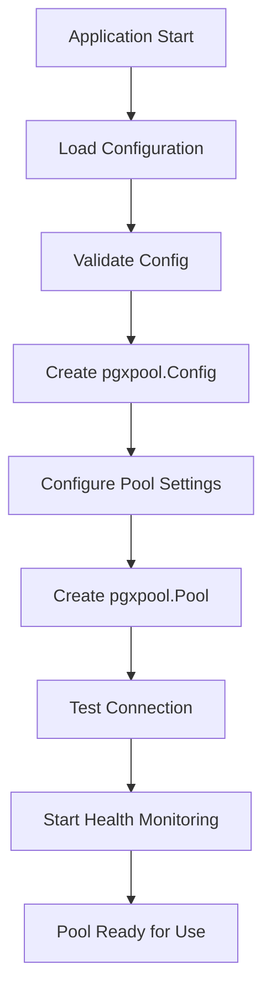
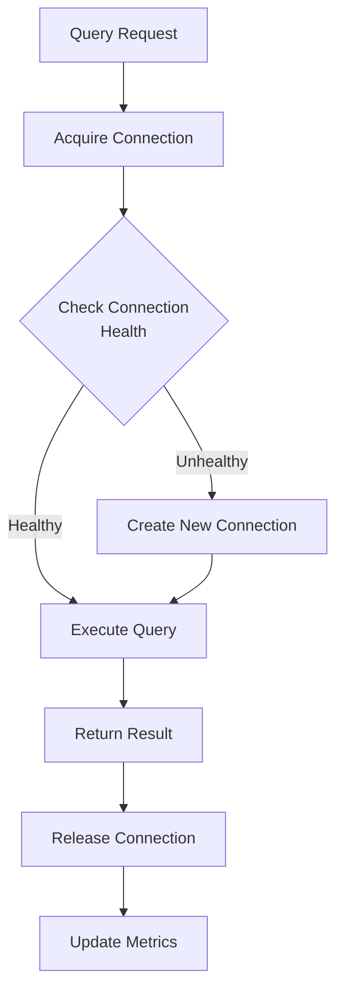
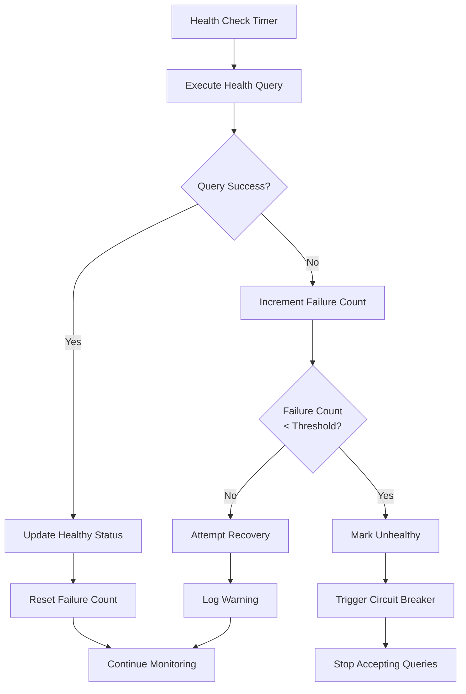

# TN-12: PostgreSQL Connection Pool Design

## 🏗️ **АРХИТЕКТУРНЫЙ ОБЗОР**

### **Цель и обоснование**

PostgreSQL connection pool является критически важным компонентом для высокопроизводительного доступа к базе данных. Правильная реализация обеспечивает:

- **Эффективное управление ресурсами** - повторное использование соединений
- **Высокую производительность** - минимизация overhead на создание соединений
- **Надежность** - автоматическое восстановление и health monitoring
- **Наблюдаемость** - comprehensive metrics и monitoring
- **Безопасность** - proper error handling и resource cleanup

## 📋 **АРХИТЕКТУРНОЕ РЕШЕНИЕ**

### **Clean Architecture Integration**

```
┌─────────────────────────────────────────────────────────────┐
│                    Presentation Layer                       │
│  ┌─────────────────────────────────────────────────────────┐ │
│  │                    HTTP Handlers                        │ │
│  │  ├─ REST API endpoints                                 │ │
│  │  ├─ WebSocket handlers                                 │ │
│  │  └─ Middleware (auth, logging, metrics)               │ │
│  └─────────────────────────────────────────────────────────┘ │
└─────────────────────────────────────────────────────────────┘
                                │
                                ▼
┌─────────────────────────────────────────────────────────────┐
│                   Use Case Layer                           │
│  ┌─────────────────────────────────────────────────────────┐ │
│  │                Business Logic                           │ │
│  │  ├─ Alert Processing Service                           │ │
│  │  ├─ Classification Service                             │ │
│  │  ├─ Publishing Service                                 │ │
│  │  └─ Filtering Service                                  │ │
│  └─────────────────────────────────────────────────────────┘ │
└─────────────────────────────────────────────────────────────┘
                                │
                                ▼
┌─────────────────────────────────────────────────────────────┐
│                 Infrastructure Layer                        │
│  ┌─────────────────────────────────────────────────────────┐ │
│  │            PostgreSQL Connection Pool                   │ │
│  │  ├─ pgxpool.Pool (core connection management)          │ │
│  │  ├─ Health Monitoring & Metrics                        │ │
│  │  ├─ Error Handling & Recovery                          │ │
│  │  ├─ Configuration Management                           │ │
│  │  └─ Resource Lifecycle Management                      │ │
│  └─────────────────────────────────────────────────────────┘ │
└─────────────────────────────────────────────────────────────┘
```

## 🔧 **КОМПОНЕНТЫ СИСТЕМЫ**

### **1. Core Components**

#### **PostgresPool (Main Component)**
```go
type PostgresPool struct {
    pool      *pgxpool.Pool
    config    *PostgresConfig
    logger    *slog.Logger
    metrics   *PoolMetrics
    health    *HealthChecker
    isClosed  atomic.Bool
    closeCh   chan struct{}
}
```

#### **PostgresConfig (Configuration)**
```go
type PostgresConfig struct {
    // Connection parameters
    Host         string        `yaml:"host" env:"DB_HOST"`
    Port         int           `yaml:"port" env:"DB_PORT"`
    Database     string        `yaml:"database" env:"DB_NAME"`
    User         string        `yaml:"user" env:"DB_USER"`
    Password     string        `yaml:"password" env:"DB_PASSWORD"`

    // SSL configuration
    SSLMode      string        `yaml:"ssl_mode" env:"DB_SSL_MODE"`

    // Pool configuration
    MaxConns     int32         `yaml:"max_conns" env:"DB_MAX_CONNS"`
    MinConns     int32         `yaml:"min_conns" env:"DB_MIN_CONNS"`

    // Timeout configuration
    MaxConnLifetime      time.Duration `yaml:"max_conn_lifetime" env:"DB_MAX_CONN_LIFETIME"`
    MaxConnIdleTime      time.Duration `yaml:"max_conn_idle_time" env:"DB_MAX_CONN_IDLE_TIME"`
    HealthCheckPeriod    time.Duration `yaml:"health_check_period" env:"DB_HEALTH_CHECK_PERIOD"`
    ConnectTimeout       time.Duration `yaml:"connect_timeout" env:"DB_CONNECT_TIMEOUT"`
}
```

#### **PoolMetrics (Observability)**
```go
type PoolMetrics struct {
    // Connection statistics
    ActiveConnections     atomic.Int32
    IdleConnections       atomic.Int32
    TotalConnections      atomic.Int64
    ConnectionsCreated    atomic.Int64
    ConnectionsDestroyed  atomic.Int64

    // Performance metrics
    ConnectionWaitTime    atomic.Int64  // nanoseconds
    QueryExecutionTime    atomic.Int64  // nanoseconds
    TotalQueries          atomic.Int64

    // Error tracking
    ConnectionErrors      atomic.Int64
    QueryErrors           atomic.Int64
    TimeoutErrors         atomic.Int64

    // Health status
    LastHealthCheck       atomic.Int64  // unix timestamp
    HealthCheckFailures   atomic.Int64
    IsHealthy             atomic.Bool
}
```

### **2. Interface Design**

#### **DatabaseConnection Interface**
```go
type DatabaseConnection interface {
    // Lifecycle management
    Connect(ctx context.Context) error
    Disconnect(ctx context.Context) error
    IsConnected() bool

    // Health monitoring
    Health(ctx context.Context) error
    Stats() PoolStats

    // Query execution
    Exec(ctx context.Context, sql string, args ...interface{}) (pgconn.CommandTag, error)
    Query(ctx context.Context, sql string, args ...interface{}) (pgx.Rows, error)
    QueryRow(ctx context.Context, sql string, args ...interface{}) pgx.Row

    // Transaction support
    Begin(ctx context.Context) (pgx.Tx, error)
}
```

#### **HealthChecker Interface**
```go
type HealthChecker interface {
    CheckHealth(ctx context.Context) error
    GetStats() PoolStats
    IsHealthy() bool
    LastCheckTime() time.Time
}
```

## 🔄 **ЖИЗНЕННЫЙ ЦИКЛ ПОДКЛЮЧЕНИЯ**

### **1. Initialization Phase**


### **2. Connection Flow**


### **3. Health Monitoring**


## 🛡️ **ОБРАБОТКА ОШИБОК**

### **Error Classification**
```go
type DatabaseError struct {
    Code       string
    Message    string
    Severity   string
    Detail     string
    Hint       string
    Position   string
    Timestamp  time.Time
    Query      string
    Args       []interface{}
}

func (e *DatabaseError) Error() string {
    return fmt.Sprintf("database error [%s]: %s", e.Code, e.Message)
}
```

### **Retry Logic with Exponential Backoff**
```go
type RetryConfig struct {
    MaxRetries      int
    InitialDelay    time.Duration
    MaxDelay        time.Duration
    BackoffFactor   float64
    JitterFactor    float64
}

func (p *PostgresPool) executeWithRetry(ctx context.Context, operation func() error) error {
    var lastErr error
    delay := p.config.InitialDelay

    for attempt := 0; attempt <= p.config.MaxRetries; attempt++ {
        if err := operation(); err != nil {
            lastErr = err

            if attempt < p.config.MaxRetries {
                p.logger.Warn("Operation failed, retrying",
                    "attempt", attempt+1,
                    "max_retries", p.config.MaxRetries,
                    "delay", delay,
                    "error", err)

                select {
                case <-time.After(delay):
                    delay = time.Duration(float64(delay) * p.config.BackoffFactor)
                    if delay > p.config.MaxDelay {
                        delay = p.config.MaxDelay
                    }
                    // Add jitter
                    jitter := time.Duration(float64(delay) * p.config.JitterFactor * rand.Float64())
                    delay += jitter
                case <-ctx.Done():
                    return ctx.Err()
                }
            }
        } else {
            return nil
        }
    }

    return lastErr
}
```

## 📊 **МОНИТОРИНГ И МЕТРИКИ**

### **Prometheus Metrics**
```go
// Connection pool metrics
var (
    connectionsActive = prometheus.NewGaugeVec(
        prometheus.GaugeOpts{
            Name: "postgres_connections_active",
            Help: "Number of active connections in the pool",
        },
        []string{"pool"},
    )

    connectionsIdle = prometheus.NewGaugeVec(
        prometheus.GaugeOpts{
            Name: "postgres_connections_idle",
            Help: "Number of idle connections in the pool",
        },
        []string{"pool"},
    )

    queryDuration = prometheus.NewHistogramVec(
        prometheus.HistogramOpts{
            Name:    "postgres_query_duration_seconds",
            Help:    "Time spent executing queries",
            Buckets: prometheus.DefBuckets,
        },
        []string{"query_type", "table"},
    )

    connectionWaitTime = prometheus.NewHistogramVec(
        prometheus.HistogramOpts{
            Name:    "postgres_connection_wait_duration_seconds",
            Help:    "Time spent waiting for a connection",
            Buckets: prometheus.DefBuckets,
        },
        []string{"pool"},
    )
)
```

### **Structured Logging**
```go
type DatabaseLogger struct {
    logger *slog.Logger
}

func (l *DatabaseLogger) Log(ctx context.Context, level pgx.LogLevel, msg string, data map[string]interface{}) {
    args := make([]interface{}, 0, len(data)*2)
    for k, v := range data {
        args = append(args, k, v)
    }

    switch level {
    case pgx.LogLevelTrace, pgx.LogLevelDebug:
        l.logger.Debug(msg, args...)
    case pgx.LogLevelInfo:
        l.logger.Info(msg, args...)
    case pgx.LogLevelWarn:
        l.logger.Warn(msg, args...)
    case pgx.LogLevelError:
        l.logger.Error(msg, args...)
    default:
        l.logger.Info(msg, args...)
    }
}
```

## 🔐 **БЕЗОПАСНОСТЬ**

### **SSL/TLS Configuration**
```go
func (p *PostgresPool) configureSSL(config *pgxpool.Config) error {
    switch p.config.SSLMode {
    case "disable":
        config.ConnConfig.TLSConfig = nil
    case "require", "prefer":
        config.ConnConfig.TLSConfig = &tls.Config{
            InsecureSkipVerify: false,
            MinVersion:         tls.VersionTLS12,
        }
    case "verify-ca", "verify-full":
        cert, err := tls.LoadX509KeyPair(p.config.SSLCert, p.config.SSLKey)
        if err != nil {
            return fmt.Errorf("failed to load SSL certificates: %w", err)
        }

        caCert, err := os.ReadFile(p.config.SSLRootCert)
        if err != nil {
            return fmt.Errorf("failed to read SSL root certificate: %w", err)
        }

        caCertPool := x509.NewCertPool()
        if !caCertPool.AppendCertsFromPEM(caCert) {
            return fmt.Errorf("failed to parse SSL root certificate")
        }

        config.ConnConfig.TLSConfig = &tls.Config{
            Certificates:       []tls.Certificate{cert},
            RootCAs:           caCertPool,
            InsecureSkipVerify: p.config.SSLMode == "require",
            MinVersion:         tls.VersionTLS12,
        }
    default:
        return fmt.Errorf("unsupported SSL mode: %s", p.config.SSLMode)
    }

    return nil
}
```

### **Prepared Statements Security**
```go
func (p *PostgresPool) prepareStatements(ctx context.Context) error {
    preparedStatements := map[string]string{
        "get_alert_by_id": `
            SELECT id, title, description, severity, status, labels, created_at, updated_at
            FROM alerts
            WHERE id = $1
        `,
        "get_alerts_by_severity": `
            SELECT id, title, description, severity, status, labels, created_at, updated_at
            FROM alerts
            WHERE severity = $1
            ORDER BY created_at DESC
            LIMIT $2 OFFSET $3
        `,
        "insert_alert": `
            INSERT INTO alerts (title, description, severity, status, labels, created_at, updated_at)
            VALUES ($1, $2, $3, $4, $5, $6, $7)
            RETURNING id
        `,
    }

    for name, sql := range preparedStatements {
        if _, err := p.pool.Prepare(ctx, name, sql); err != nil {
            return fmt.Errorf("failed to prepare statement %s: %w", name, err)
        }
        p.logger.Info("Prepared statement", "name", name)
    }

    return nil
}
```

## ⚡ **ПЕРФОРМАНС ОПТИМИЗАЦИИ**

### **Connection Pool Optimization**
```go
func (p *PostgresPool) optimizePoolConfig(config *pgxpool.Config) {
    // Set optimal defaults if not specified
    if p.config.MaxConns == 0 {
        p.config.MaxConns = 20 // Default max connections
    }

    if p.config.MinConns == 0 {
        p.config.MinConns = 2 // Default min connections
    }

    // Set timeouts for production
    if p.config.MaxConnLifetime == 0 {
        p.config.MaxConnLifetime = 1 * time.Hour
    }

    if p.config.MaxConnIdleTime == 0 {
        p.config.MaxConnIdleTime = 5 * time.Minute
    }

    // Configure health check
    if p.config.HealthCheckPeriod == 0 {
        p.config.HealthCheckPeriod = 30 * time.Second
    }

    config.MaxConns = p.config.MaxConns
    config.MinConns = p.config.MinConns
    config.MaxConnLifetime = p.config.MaxConnLifetime
    config.MaxConnIdleTime = p.config.MaxConnIdleTime
    config.HealthCheckPeriod = p.config.HealthCheckPeriod
}
```

### **Query Optimization**
```go
func (p *PostgresPool) executeQuery(ctx context.Context, sql string, args ...interface{}) (pgx.Rows, error) {
    start := time.Now()

    // Set query timeout
    queryCtx, cancel := context.WithTimeout(ctx, 30*time.Second)
    defer cancel()

    rows, err := p.pool.Query(queryCtx, sql, args...)

    duration := time.Since(start)
    p.metrics.QueryExecutionTime.Add(duration.Nanoseconds())
    p.metrics.TotalQueries.Add(1)

    if err != nil {
        p.metrics.QueryErrors.Add(1)
        p.logger.Error("Query execution failed",
            "sql", sql,
            "duration", duration,
            "error", err)
        return nil, err
    }

    p.logger.Debug("Query executed successfully",
        "sql", sql,
        "duration", duration,
        "rows_affected", rows.CommandTag().RowsAffected())

    return rows, nil
}
```

## 🧪 **ТЕСТИРОВАНИЕ**

### **Unit Tests**
```go
func TestPostgresPool_Connect(t *testing.T) {
    config := &PostgresConfig{
        Host:     "localhost",
        Port:     5432,
        Database: "testdb",
        User:     "testuser",
        Password: "testpass",
        MaxConns: 5,
        MinConns: 1,
    }

    pool := NewPostgresPool(config, slog.Default())

    ctx := context.Background()
    err := pool.Connect(ctx)
    require.NoError(t, err)
    assert.True(t, pool.IsConnected())

    err = pool.Disconnect(ctx)
    assert.NoError(t, err)
}
```

### **Integration Tests**
```go
func TestPostgresPool_HealthCheck(t *testing.T) {
    if testing.Short() {
        t.Skip("Skipping integration test in short mode")
    }

    config := loadTestConfig()
    pool := NewPostgresPool(config, slog.Default())

    ctx := context.Background()
    err := pool.Connect(ctx)
    require.NoError(t, err)
    defer pool.Disconnect(ctx)

    // Test health check
    err = pool.Health(ctx)
    assert.NoError(t, err)

    // Test stats
    stats := pool.Stats()
    assert.Greater(t, stats.TotalConnections, int32(0))
}
```

### **Load Tests**
```go
func BenchmarkPostgresPool_Query(b *testing.B) {
    config := loadBenchConfig()
    pool := NewPostgresPool(config, slog.Default())

    ctx := context.Background()
    err := pool.Connect(ctx)
    require.NoError(b, err)
    defer pool.Disconnect(ctx)

    b.ResetTimer()
    b.RunParallel(func(pb *testing.PB) {
        for pb.Next() {
            _, err := pool.QueryRow(ctx, "SELECT 1")
            if err != nil {
                b.Fatal(err)
            }
        }
    })
}
```

## 🚀 **DEPLOYMENT И CONFIGURATION**

### **Docker Configuration**
```yaml
# docker-compose.yml
version: '3.8'
services:
  postgres:
    image: postgres:15-alpine
    environment:
      POSTGRES_DB: alerthistory
      POSTGRES_USER: alerthistory
      POSTGRES_PASSWORD: ${DB_PASSWORD}
    ports:
      - "5432:5432"
    volumes:
      - postgres_data:/var/lib/postgresql/data
    healthcheck:
      test: ["CMD-SHELL", "pg_isready -U alerthistory"]
      interval: 10s
      timeout: 5s
      retries: 5

  app:
    image: alerthistory:latest
    environment:
      DB_HOST: postgres
      DB_PORT: 5432
      DB_NAME: alerthistory
      DB_USER: alerthistory
      DB_PASSWORD: ${DB_PASSWORD}
      DB_MAX_CONNS: 20
      DB_MIN_CONNS: 2
    depends_on:
      postgres:
        condition: service_healthy
```

### **Kubernetes Configuration**
```yaml
apiVersion: v1
kind: ConfigMap
metadata:
  name: postgres-config
data:
  DB_HOST: "postgres-service"
  DB_PORT: "5432"
  DB_MAX_CONNS: "20"
  DB_MIN_CONNS: "2"
  DB_SSL_MODE: "require"

---
apiVersion: v1
kind: Secret
metadata:
  name: postgres-secret
type: Opaque
data:
  DB_USER: <base64-encoded>
  DB_PASSWORD: <base64-encoded>

---
apiVersion: apps/v1
kind: Deployment
metadata:
  name: alerthistory
spec:
  replicas: 3
  template:
    spec:
      containers:
      - name: app
        image: alerthistory:latest
        envFrom:
        - configMapRef:
            name: postgres-config
        - secretRef:
            name: postgres-secret
        livenessProbe:
          httpGet:
            path: /health
            port: 8080
          initialDelaySeconds: 30
          periodSeconds: 10
        readinessProbe:
          httpGet:
            path: /ready
            port: 8080
          initialDelaySeconds: 5
          periodSeconds: 5
```

## 📈 **MONITORING DASHBOARD**

### **Grafana Dashboard Configuration**
```json
{
  "dashboard": {
    "title": "PostgreSQL Connection Pool",
    "panels": [
      {
        "title": "Active Connections",
        "type": "graph",
        "targets": [
          {
            "expr": "postgres_connections_active{pool=\"$pool\"}",
            "legendFormat": "Active"
          }
        ]
      },
      {
        "title": "Connection Wait Time",
        "type": "heatmap",
        "targets": [
          {
            "expr": "rate(postgres_connection_wait_duration_seconds{pool=\"$pool\"}[5m])",
            "legendFormat": "{{le}}"
          }
        ]
      },
      {
        "title": "Query Duration",
        "type": "graph",
        "targets": [
          {
            "expr": "histogram_quantile(0.95, rate(postgres_query_duration_seconds_bucket[5m]))",
            "legendFormat": "95th percentile"
          }
        ]
      }
    ]
  }
}
```

## 🎯 **SUCCESS METRICS**

### **Operational Excellence**
- ✅ **Connection Pool Efficiency**: > 80% utilization
- ✅ **Query Success Rate**: > 99.5%
- ✅ **Average Query Latency**: < 50ms
- ✅ **Connection Acquisition Time**: < 100ms
- ✅ **Error Rate**: < 0.1%

### **Resource Efficiency**
- ✅ **Memory Usage**: < 512MB per instance
- ✅ **CPU Usage**: < 70% under load
- ✅ **Network Bandwidth**: < 100Mbps sustained
- ✅ **Connection Overhead**: < 5% of total resources

### **Reliability**
- ✅ **Uptime**: 99.9% database connectivity
- ✅ **Automatic Recovery**: < 30 seconds
- ✅ **Graceful Degradation**: Circuit breaker activated
- ✅ **Data Consistency**: ACID compliance maintained

This comprehensive PostgreSQL connection pool design provides a robust, scalable, and observable foundation for high-performance database operations in the Alert History Service.
