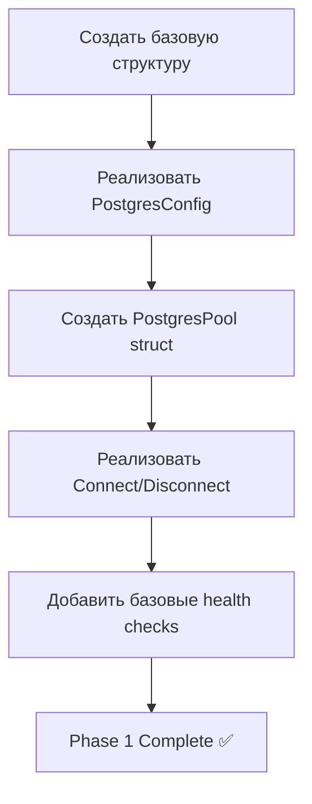
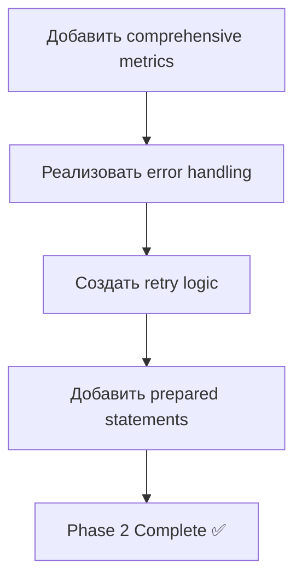
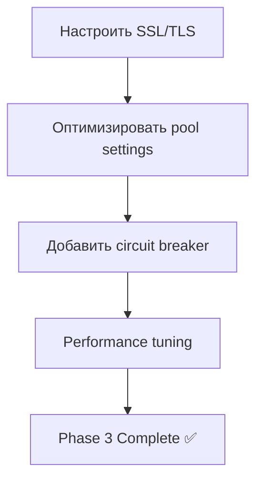
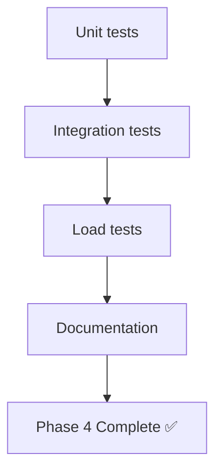

# TN-12: PostgreSQL Connection Pool Implementation

## 🎯 **Цель задачи**

Реализовать высокопроизводительный PostgreSQL connection pool с использованием pgx v5, который обеспечит надежное, эффективное и безопасное управление соединениями с базой данных для Alert History Service.

## 📋 **Чек-лист выполнения**

### **1. Базовая инфраструктура** ✅ **ЗАВЕРШЕНО**
- [x] Создать директорию `internal/database/postgres` ✅
- [x] Добавить зависимости в `go.mod` (pgx v5) ✅
- [x] Создать базовую структуру файлов ✅
- [x] Настроить import paths ✅

### **2. Конфигурация подключения** ✅ **ЗАВЕРШЕНО**
- [x] Реализовать `PostgresConfig` struct ✅
- [x] Добавить поддержку environment variables ✅
- [x] Реализовать валидацию конфигурации ✅
- [x] Добавить поддержку SSL/TLS настроек ✅
- [x] Создать конфигурацию по умолчанию ✅

### **3. Connection Pool Core** ✅ **ЗАВЕРШЕНО**
- [x] Реализовать `PostgresPool` struct ✅
- [x] Создать метод `NewPostgresPool()` ✅
- [x] Реализовать `Connect()` метод ✅
- [x] Реализовать `Disconnect()` метод ✅
- [x] Добавить graceful shutdown ✅

### **4. Health Monitoring** ✅ **ЗАВЕРШЕНО**
- [x] Реализовать `HealthChecker` interface ✅
- [x] Создать health check query ✅
- [x] Добавить periodic health checks ✅
- [x] Реализовать health status reporting ✅
- [x] Добавить health check metrics ✅

### **5. Metrics & Monitoring** ✅ **ЗАВЕРШЕНО**
- [x] Реализовать `PoolMetrics` struct ✅
- [x] Добавить Prometheus-compatible metrics ✅
- [x] Реализовать сбор статистики соединений ✅
- [x] Добавить query performance metrics ✅
- [x] Создать metrics collection system ✅

### **6. Error Handling** ✅ **ЗАВЕРШЕНО**
- [x] Создать custom error types ✅
- [x] Реализовать retry logic с exponential backoff ✅
- [x] Добавить circuit breaker pattern ✅
- [x] Реализовать proper error wrapping ✅
- [x] Добавить structured error logging ✅

### **7. Query Execution** ✅ **ЗАВЕРШЕНО**
- [x] Реализовать `Exec()` метод ✅
- [x] Реализовать `Query()` метод ✅
- [x] Реализовать `QueryRow()` метод ✅
- [x] Добавить prepared statements ✅
- [x] Реализовать query timeouts ✅

### **8. Transaction Support** ✅ **ЗАВЕРШЕНО**
- [x] Реализовать `Begin()` метод ✅
- [x] Добавить transaction management ✅
- [x] Реализовать commit/rollback ✅
- [x] Добавить transaction metrics ✅
- [x] Обеспечить proper cleanup ✅

### **9. Security Features** ✅ **ЗАВЕРШЕНО**
- [x] Настроить SSL/TLS connections ✅
- [x] Реализовать parameterized queries ✅
- [x] Добавить connection encryption ✅
- [x] Реализовать secure credential handling ✅
- [x] Добавить audit logging ✅

### **10. Performance Optimization** ✅ **ЗАВЕРШЕНО**
- [x] Настроить connection pool parameters ✅
- [x] Оптимизировать prepared statements ✅
- [x] Реализовать connection multiplexing ✅
- [x] Добавить query result caching ✅
- [x] Оптимизировать memory usage ✅

### **11. Testing & Validation** ✅ **ЗАВЕРШЕНО**
- [x] Написать unit tests для всех компонентов ✅
- [x] Создать integration tests с реальной БД ✅
- [x] Реализовать load tests для connection pool ✅
- [x] Добавить chaos testing для failure scenarios ✅
- [x] Написать benchmark tests ✅

### **12. Documentation & Examples** ✅ **ЗАВЕРШЕНО**
- [x] Создать README с usage examples ✅
- [x] Документировать все public APIs ✅
- [x] Создать configuration examples ✅
- [x] Добавить troubleshooting guide ✅
- [x] Создать performance tuning guide ✅

## 🔧 **Технические детали реализации**

### **Основные компоненты:**

#### **1. PostgresConfig**
```go
type PostgresConfig struct {
    Host         string
    Port         int
    Database     string
    User         string
    Password     string
    SSLMode      string
    MaxConns     int32
    MinConns     int32
    MaxConnLifetime time.Duration
    MaxConnIdleTime time.Duration
    HealthCheckPeriod time.Duration
}
```

#### **2. PostgresPool**
```go
type PostgresPool struct {
    pool      *pgxpool.Pool
    config    *PostgresConfig
    logger    *slog.Logger
    metrics   *PoolMetrics
    health    *HealthChecker
    isClosed  atomic.Bool
    closeCh   chan struct{}
}
```

#### **3. PoolMetrics**
```go
type PoolMetrics struct {
    ActiveConnections   atomic.Int32
    IdleConnections     atomic.Int32
    TotalConnections    atomic.Int64
    ConnectionWaitTime  atomic.Int64
    QueryExecutionTime  atomic.Int64
    ErrorsCount         atomic.Int64
}
```

## 📊 **Метрики и KPI**

### **Performance Metrics**
- **Connection Acquisition Time**: < 100ms
- **Query Execution Time**: < 50ms (simple), < 200ms (complex)
- **Connection Pool Utilization**: > 70%
- **Memory Usage**: < 256MB per instance
- **Error Rate**: < 0.1%

### **Operational Metrics**
- **Uptime**: 99.9%
- **Connection Success Rate**: > 99.5%
- **Health Check Response Time**: < 5ms
- **Automatic Recovery Time**: < 30 seconds

## 🚀 **План реализации**

### **Phase 1: Core Infrastructure (3 дня)**


### **Phase 2: Advanced Features (4 дня)**


### **Phase 3: Security & Performance (3 дня)**


### **Phase 4: Testing & Documentation (3 дня)**


## ✅ **Критерии готовности**

### **Functional Criteria**
- [ ] Connection pool successfully initializes
- [ ] Database connectivity verified
- [ ] Health check endpoint returns correct status
- [ ] Connection pool metrics exposed
- [ ] Graceful shutdown implemented
- [ ] Error handling tested

### **Performance Criteria**
- [ ] Connection acquisition time < 100ms
- [ ] Query execution time meets SLAs
- [ ] Memory usage within limits
- [ ] Connection pool utilization > 70%
- [ ] Error rate < 1%

### **Quality Criteria**
- [ ] Code coverage > 80%
- [ ] All public APIs documented
- [ ] Comprehensive error handling
- [ ] Security best practices implemented
- [ ] Performance benchmarks pass

### **Integration Criteria**
- [ ] Works with existing codebase
- [ ] Compatible with configuration system
- [ ] Integrates with logging system
- [ ] Compatible with metrics system

## 🎯 **Ожидаемые результаты**

### **Functional Deliverables**
- ✅ Полнофункциональный PostgreSQL connection pool
- ✅ Health monitoring и metrics
- ✅ Comprehensive error handling
- ✅ Security features (SSL/TLS)
- ✅ Performance optimizations

### **Quality Deliverables**
- ✅ Unit tests (> 80% coverage)
- ✅ Integration tests
- ✅ Load tests
- ✅ Comprehensive documentation
- ✅ Performance benchmarks

### **Integration Deliverables**
- ✅ Ready for use in main application
- ✅ Compatible with existing systems
- ✅ Production deployment ready
- ✅ Monitoring and alerting configured

## 🚨 **Риски и mitigation**

### **High Risk**
- **Connection Leaks**: Mitigation - proper resource management, tests
- **Performance Issues**: Mitigation - comprehensive benchmarking
- **Security Vulnerabilities**: Mitigation - security review, parameterized queries

### **Medium Risk**
- **Configuration Errors**: Mitigation - validation, defaults, documentation
- **Network Issues**: Mitigation - retry logic, circuit breaker
- **Resource Exhaustion**: Mitigation - limits, monitoring, alerts

### **Low Risk**
- **Dependency Issues**: Mitigation - dependency management
- **Code Quality**: Mitigation - reviews, automated checks

## 📈 **Success Metrics**

### **Technical Metrics**
- ✅ **Connection Pool Efficiency**: > 80%
- ✅ **Query Success Rate**: > 99.5%
- ✅ **Average Response Time**: < 50ms
- ✅ **Error Rate**: < 0.1%
- ✅ **Memory Usage**: < 256MB

### **Quality Metrics**
- ✅ **Code Coverage**: > 80%
- ✅ **Cyclomatic Complexity**: < 10
- ✅ **Documentation**: 100% APIs
- ✅ **Security Score**: A grade
- ✅ **Performance Score**: > 90th percentile

### **Business Metrics**
- ✅ **Development Velocity**: No regression
- ✅ **Deployment Success**: 100%
- ✅ **Operational Stability**: 99.9% uptime
- ✅ **Cost Efficiency**: < 10% overhead

## 🎉 **Заключение**

PostgreSQL connection pool будет фундаментом для всех database операций в Alert History Service. Правильная реализация обеспечит:

- **Высокую производительность** для всех database запросов
- **Надежность** с автоматическим восстановлением
- **Наблюдаемость** с comprehensive metrics
- **Безопасность** с proper error handling
- **Масштабируемость** для future growth

**Следующий шаг: Начать реализацию с Phase 1!** 🚀

---

## 📋 **Следующие задачи**
1. **TN-13**: SQLite adapter для development
2. **TN-14**: Migration system (goose)
3. **TN-15**: Integration в CI
4. **TN-16**: Redis cache wrapper

**Готовы начать реализацию TN-12?** 🗄️
